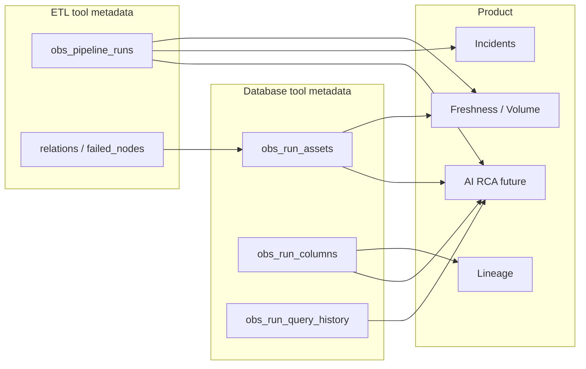

# Metadata fields — database tools vs ETL tools

What we store from each tool type, **why** we store it, and **where** it is used in the product (dashboard, monitors, lineage, RCA, future AI).

We **observe only** — no pipeline execution, no warehouse row data, no plaintext secrets in these tables.

Related: [`METADATA_MODEL.md`](METADATA_MODEL.md) (architecture) · [`DASHBOARD_API.md`](DASHBOARD_API.md) (APIs)

---

## Summary

| Source | Stored in | When collected | Primary uses |
|--------|-----------|----------------|--------------|
| **Database tool** | `obs_run_assets`, `obs_run_columns`, `obs_tool_snapshots`, `obs_run_query_history` | On Sync (cached per tool ~5 min) | Freshness, volume, schema drift, lineage nodes, RCA query context |
| **ETL tool** | `obs_pipeline_runs` (+ JSON in `raw_log`) | On Sync (always fresh per pipeline) | Run status, failures, incidents, metrics, RCA, lineage table list |

---

# Part 1 — Database tools

Database tools: **Snowflake**, **MySQL**, **PostgreSQL**, **Redshift**, **BigQuery**  
(`kind: database` in `obs_connector_instances`)

---

## 1A. Registration metadata (tool config)

Stored in **`obs_connector_instances.config_json`** when you call `POST /v1/tools`.  
Passwords go to **`obs_secrets`** only — never in config.

| Field | Example | Why we store it | Where it is used |
|-------|---------|-----------------|------------------|
| `account_id` | `jd97000.ap-southeast-7.aws` | Snowflake account locator to connect | Connector `test_connection`, Sync pull |
| `host` | `127.0.0.1` | Server address for MySQL/Postgres/Redshift | Same |
| `port` | `3306` / `5432` | Connection port | Same |
| `user_id` / `user` | `OBS_USER` | Login identity | Same |
| `warehouse_id` | `ECOMMERCE_WH` | Snowflake compute for catalog queries | Snowflake connector |
| `database_id` / `database` | `ECOMMERCE` | Which database to scan | Limits scope of metadata pull |
| `schema` | `SRC_DATA` | Schema filter | Narrows tables/columns collected |
| `tables` | `["RAW_ORDERS","RAW_CUSTOMERS"]` | **Pipeline grain** — which tables matter | Sync only pulls these (+ dbt relations for targets); lineage anchors |
| `sf_role` / `role` | `ACCOUNTADMIN` | Snowflake role for permissions | Connection |
| `project_id` | (BigQuery) | GCP project | BQ connector |
| `dataset` | (BigQuery) | BQ dataset ≈ schema | BQ connector |
| `location` | `US` | BQ job region | BQ connector |
| `credentials_path` | path to JSON key file | How to auth to GCP (path only) | BQ connector |

**Why registration exists:** Connect once, reuse across pipelines. Config describes *where* to look, not *what happened* on a run.

**Where used:** `POST /v1/tools`, `POST /v1/pipelines/from-tools`, `connector_kwargs_from_tool()` at Sync time.

---

## 1B. Table metadata (per Sync, per run)

Collected from warehouse **catalog views** (`INFORMATION_SCHEMA`, BigQuery API, etc.)  
Mapped by `map_dataset()` → stored in **`obs_run_assets`**.

| Field | Source (typical) | Why we store it | Where it is used |
|-------|------------------|-----------------|------------------|
| `run_id` | ETL run id for this Sync | Links warehouse snapshot to the pipeline run that triggered observation | Run detail, lineage detail, joins across tables |
| `asset_role` | `SOURCE` or `TARGET` | Pipeline semantics — raw vs transformed side | Freshness (TARGET), volume (TARGET), lineage graph, filters |
| `system_name` | e.g. `Snowflake` | Human-readable platform | UI labels, pipeline detail |
| `system_type` | `DATA_WAREHOUSE` / `DATABASE` | Category for filters/charts | Dashboard, lineage |
| `database_name` | `TABLE_CATALOG` | Fully qualified object identity | Lineage nodes, schema diff, RCA context |
| `schema_name` | `TABLE_SCHEMA` | Same | Same |
| `object_name` | `TABLE_NAME` | Same | Same |
| `object_type` | `TABLE` | Object kind (tables only today) | Asset display |
| `row_count` | `ROW_COUNT` / catalog | **Volume** observability — how much data | `/api/v1/observability/volume`, overview KPIs, volume-drop monitors, `rows_added` calculation |
| `size_bytes` | `BYTES` (Snowflake) | Storage / throughput signals | Volume page, metrics |
| `column_count` | count from column fetch | Quick schema richness signal | Asset cards, overview |
| `last_updated_at` | `LAST_ALTERED` | **Freshness** — when table last changed | `/api/v1/observability/freshness`, freshness SLA monitors, lineage health |
| `observed_at` | UTC now at pull time | When *we* saw this state | Audit, debugging stale snapshots |
| `dataset_id` | `DB.SCHEMA.TABLE` | Stable key for dedup and lineage edges | Unique key with `run_id` + `asset_role`; snapshot cache |
| `tenant_id` | platform tenant | Multi-tenant isolation (future) | Filtering |
| `connector_instance_id` | tool id | Which DB tool produced this | Tool-wise snapshots, bindings |

**Why we store table metadata:** Monte Carlo–style signals without reading row data — freshness lag, volume change, and schema context for RCA.

**Where used:**

- **Overview** — pipeline health, volume/freshness pillars  
- **Freshness page** — `last_updated_at` vs SLA  
- **Volume page** — `row_count` / `size_bytes` deltas  
- **Incidents** — blast radius = count of TARGET assets on failed run  
- **Lineage** — nodes for source/target tables on latest run  
- **Future AI RCA** — “table X had N rows and was last altered at …”

---

## 1C. Column metadata (per Sync, per run)

Collected via `fetch_columns()` → **`obs_run_columns`**.

| Field | Why we store it | Where it is used |
|-------|-----------------|------------------|
| `run_id` | Tie columns to a specific observation run | Schema diff, run detail |
| `asset_role` | SOURCE vs TARGET column sets | Schema page per role |
| `database_name`, `schema_name`, `object_name` | Locate table | Schema diff grouping |
| `column_name` | Identity of field | Schema drift detection |
| `data_type` | Type string from catalog | Breaking change detection (type change) |
| `ordinal_position` | Column order | Stable diff / display |
| `dataset_id` | `DB.SCHEMA.TABLE` key | Join to assets |

**Why:** **Schema drift** and **DQA** need column-level history. **AI RCA** needs to know if failure was due to missing column, type mismatch, etc.

**Where used:**

- **`/api/v1/observability/schema`** — diff last two successful runs  
- **Lineage detail** — schema status (when wired)  
- **Future AI RCA** — schema bundle for failed model’s relations  
- **Future DQA** — null/uniqueness checks per column

---

## 1D. Tool snapshots (cached, not per-run)

Same payload as assets/columns, stored in **`obs_tool_snapshots`**.

| Field | Why we store it | Where it is used |
|-------|-----------------|------------------|
| `instance_id` | DB tool id | Share metadata across pipelines using same Snowflake tool |
| `asset_role` | SOURCE or TARGET cache slot | Separate cache per role |
| `dataset_id` | Table key | One row per table per tool |
| `payload_json` | Serialized asset row | Reused on Sync without re-querying warehouse |
| `columns_json` | Serialized column list | Same |
| `fingerprint` | Hash of payload | Skip no-op writes (future optimization) |
| `pulled_at` | Cache timestamp | TTL check (default 300s) |

**Why:** Two pipelines sharing one Snowflake tool should not double-hit the warehouse every 5 minutes.

**Where used:** `_collect_db_side()` in `sync_once.py` — if snapshot fresh, copy into current `run_id` for `obs_run_assets`.

---

## 1E. Query history (Snowflake, on failed runs)

Best-effort pull → **`obs_run_query_history`**.

| Field | Why we store it | Where it is used |
|-------|-----------------|------------------|
| `run_id` | Link queries to pipeline run | Run detail, RCA |
| `query_id` | Snowflake query id | Deep-link / dedup |
| `start_time`, `end_time` | When query ran | Correlate with ETL failure time |
| `execution_status` | success/fail | Filter failed SQL |
| `error_code`, `error_message` | Warehouse error | **RCA** — root cause text |
| `query_text` | SQL (truncated ~2k chars) | **RCA** — what SQL failed |
| `warehouse_name`, `user_name` | Context | RCA narrative |
| `database_name`, `schema_name` | Context | Tie query to dataset |

**Why:** dbt tells you *which model* failed; Snowflake tells you *which SQL* failed. Together they power human and **AI RCA**.

**Where used:** `GET /api/v1/runs/{run_id}` → `query_history` array.

---

# Part 2 — ETL tools

ETL / orchestrator tools: **dbt** / **dbt_cloud**, **Airbyte**, **Airflow**  
(`kind: etl` or `orchestrator`)

---

## 2A. Registration metadata (tool config)

Stored in **`obs_connector_instances.config_json`**.  
API tokens → **`obs_secrets`**.

### dbt Cloud

| Field | Example | Why we store it | Where it is used |
|-------|---------|-----------------|------------------|
| `account_id` | `70506183153835` | dbt Cloud account for API paths | All dbt API calls |
| `project_id` | `70506183156878` | Filter runs to one project | `_fetch_runs()` when no job_id |
| `job_id` | `70506183136444` | One job = one pipeline ETL step | Fetch runs for that job only |
| `project_name` | `ecommerce` | Display label on runs | `obs_pipeline_runs.pipeline_name` fallback, UI |
| `api_base` | `https://eg250.us1.dbt.com/api/v2` | Host varies per dbt cell | Must match where token is valid |

### Airbyte (optional)

| Field | Why | Where |
|-------|-----|-------|
| `base_url` | Airbyte API | `pull_state` |
| `connection_id`, `workspace_id` | Which sync job | ETL run mapping |

### Airflow (optional)

| Field | Why | Where |
|-------|-----|-------|
| `base_url` | REST API | DAG run fetch |
| `dag_id` | Filter runs | Orchestrator mapping |

**Why:** ETL tool config is the address book for run metadata — not the runs themselves.

---

## 2B. Run metadata (per Sync, per pipeline)

Collected from dbt Cloud API + **`run_results.json` artifact**  
Mapped by `map_run()` → stored in **`obs_pipeline_runs`**.

| Field | Source | Why we store it | Where it is used |
|-------|--------|-----------------|------------------|
| `id` | dbt `run_id` | Vendor primary key; idempotent upsert | Sync, webhooks, run detail URL |
| `obs_run_id` | generated UUID | Platform correlation id (internal) | Cross-system tracing, future AI session |
| `pipeline_id` | pipeline registry | Which pipeline this run belongs to | All dashboard filters, incidents |
| `pipeline_name` | pipeline / project | Human label | Overview, pipelines list, logs |
| `status` | mapped: success/failed/running | Core health signal | Success rate, incidents, overview charts |
| `start_time`, `end_time` | dbt API | Duration and timeline | Metrics, logs, freshness fallback |
| `duration` | computed seconds | Performance observability | Overview charts, `/api/v1/metrics` |
| `tool_name` | `dbt` | Which ETL tool | Filters, KPI breakdown |
| `rows_read` | `run_results.json` aggregates | ETL throughput signal | Run cards, overview (when present) |
| `rows_written` | same | same | same |
| `rows_added` | computed vs prior TARGET total | Net new rows heuristic | Volume narrative, run detail |
| `failure_stage` | inferred: etl / compile / … | **RCA** — where in stack it broke | Incidents severity, run detail |
| `failed_node` | first failed dbt `unique_id` | **RCA** — which model/test | Incidents, AI context |
| `failed_message` | node error text | **RCA** — human-readable cause | Run detail, AI context |
| `failed_nodes_json` | all failed nodes + messages | **RCA** — multi-model failures | Future AI (full failure set) |
| `error_class` | compilation / runtime / permission / timeout | **RCA** + incident severity | Incidents (compilation → critical) |
| `error_message` | dbt status message | Summary error | Overview failed runs, alerts |
| `raw_log` | full dbt run JSON blob | Audit + future parsing (`relations`, artifacts) | Debugging; extract fields later without re-sync |
| `execution_mode` | e.g. `orchestrated` | How job was triggered | Run metadata |
| `triggered_by` | e.g. `dbt-cloud` | Source of trigger | Ops / audit |
| `orchestrator_tool` | null until Airflow linked | Parent orchestrator | Future: Airflow → dbt chain |
| `orchestrator_dag_id` | null | DAG id | Future lineage |
| `orchestrator_task_id` | null | Task id | Future RCA |
| `orchestrator_run_id` | null | Parent run id | Future correlation |
| `tenant_id` | demo / tenant | Isolation | Multi-tenant |
| `connector_instance_id` | ETL tool id | Which tool ran | Bindings, tool test |

**Why:** ETL run row is the **spine** of observability — every dashboard run chart, incident, and log view hangs off `obs_pipeline_runs`.

**Where used:**

- **`/api/v1/overview`** — KPIs, success rate, failed runs list  
- **`/api/v1/pipelines/{id}/runs`** — run history  
- **`/api/v1/logs`**, **`/api/v1/metrics`** — time series  
- **`/api/v1/incidents`** — open failure = latest run failed  
- **`evaluate_monitors()`** — failure monitors  
- **Grafana views** — `vw_kpi_totals`, `vw_failed_runs`, `vw_pipeline_health`  
- **Future AI RCA** — primary failure object

---

## 2C. ETL fields inside `raw_log` (dbt, today)

Not separate columns yet — stored inside **`raw_log`** JSON from the connector envelope.

| Field in `raw` | Why we collect it | Where it is used today | Planned use |
|----------------|-------------------|------------------------|-------------|
| `run_id`, `job_id` | Identity | Mapped to columns | — |
| `relations[]` | Tables/models touched this run | **Target table filter** on Sync (`relation_short_names`) | Lineage edges, expand SOURCE/ TARGET schema pull |
| `failed_nodes[]` | All failed models | Mapped to `failed_nodes_json` | AI RCA |
| `node_count` | How many models in run | Debugging | Metrics |
| `rows_from` | artifact source hint | Debugging | — |
| `status`, `started_at`, `finished_at` | Run lifecycle | Mapped to columns | — |

**Why `relations[]` matters:** Tells us which tables to pull from the warehouse for this run without scanning full schema — powers lineage and AI context.

---

## 2D. ETL metadata not stored yet (planned)

| Data | Why we want it | Target table | Used for |
|------|----------------|--------------|----------|
| **dbt `manifest.json`** | Model `depends_on` graph | `obs_lineage_edges` | Column/model lineage, AI upstream/downstream |
| **dbt test results** | Pass/fail per test | `obs_check_results` | DQA page, AI (“was it a test failure?”) |
| **dbt `catalog.json`** | Column types from dbt | optional enrich `obs_run_columns` | Schema without warehouse round-trip |
| **Airbyte job payload** | Sync status per connection | `obs_pipeline_runs` | Non-dbt pipelines |

---

# Part 3 — How database + ETL metadata work together

On each **Sync**:

```
1. ETL tool  →  one row in obs_pipeline_runs  (always fresh)
2. dbt relations[]  →  which tables to observe in warehouse
3. Database tool  →  obs_run_assets + obs_run_columns  (SOURCE + TARGET)
4. If failed + Snowflake  →  obs_run_query_history
5. Monitors  →  obs_check_results, obs_alerts, obs_incidents
```



---

# Part 4 — What we do NOT store

| Not stored | Why |
|------------|-----|
| Warehouse **row data** | Observability only; not a copy of the lake/warehouse |
| Plaintext **passwords / API tokens** | `obs_secrets` encrypted |
| Full account **every table** | Cost + noise; we scope to pipeline + dbt `relations` |
| Full **query text** beyond ~2k chars | Size limits; enough for RCA |
| **dbt manifest** (lineage edges) | Stored in `obs_lineage_edges` |

---

# Part 5 — Quick lookup by product feature

| Feature | Database metadata | ETL metadata |
|---------|-------------------|--------------|
| **Overview KPIs** | TARGET row counts | run status, success rate |
| **Freshness** | TARGET `last_updated_at` | last successful run time |
| **Volume** | TARGET `row_count`, `size_bytes` | `rows_read` / `rows_written` |
| **Schema drift** | `obs_run_columns` | run id to pick which two runs to diff |
| **Lineage** | assets as graph nodes | pipeline bindings + `relations[]` |
| **Incidents** | TARGET asset count (blast radius) | failed run, `error_class`, `failed_node` |
| **Run detail / logs** | assets + columns for run | full run row + `raw_log` |
| **RCA (human + AI)** | query history + schema + stats + `change_since_last_success` | failed nodes, error class, relations, `compiled_sql`, all pipeline `dq_checks` |
| **DQA** | column metadata + monitor/rule checks | dbt test results in `obs_check_results` |

---

## Related files

| Doc | Content |
|-----|---------|
| [`METADATA_MODEL.md`](METADATA_MODEL.md) | Layers, sync rules, AI context bundle |
| [`CONNECTORS.md`](CONNECTORS.md) | Tool registration API |
| [`DASHBOARD_API.md`](DASHBOARD_API.md) | How APIs expose this data |
| [`MONTE_CARLO_DATA_COLLECTION.md`](MONTE_CARLO_DATA_COLLECTION.md) | Industry comparison |
