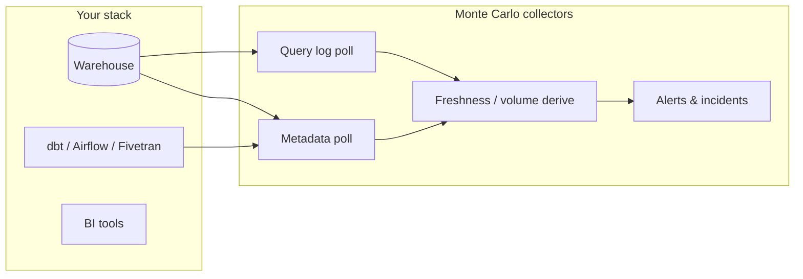

# Monte Carlo–style data collection (reference + our mapping)

Monte Carlo is a **data observability** product. It does not run your pipelines; it **connects to your stack on a schedule**, pulls **metadata and logs**, and derives **freshness, volume, schema, and incident signals** for dashboards and alerts.

This doc summarizes their public “Data Collection: Details per Integration” model and how **this repo** maps to it today.

---

## What Monte Carlo collects (four pillars)

For **data warehouses**, Monte Carlo tracks four signal types:

| Pillar | What it is | Typical use |
|--------|------------|-------------|
| **Metadata** | Tables, columns, sizes, last-altered timestamps from catalog views (`INFORMATION_SCHEMA`, `SVV_*`, BigQuery API, etc.) | Inventory, schema drift, volume baselines |
| **Query logs** | Who ran what SQL, when, success/failure (e.g. Snowflake `QUERY_HISTORY`, Redshift `STL_*`) | Lineage hints, freshness from write queries, RCA |
| **Freshness** | How stale each table/dataset is vs expectation | SLA monitors, “data is late” incidents |
| **Volume** | Row/byte counts over time | Anomaly detection (drops/spikes) |

**Cadence varies by integration** — e.g. Snowflake metadata hourly, Redshift query logs every 10 minutes. Orchestration tools (dbt, Airflow) are often **API pull on a schedule** or **push when a run finishes**.

---

## Monte Carlo collection schedule (summary)

### Data warehouses

| Integration | Metadata | Query logs | Freshness | Volume |
|-------------|----------|------------|-----------|--------|
| **Redshift** | Hourly (SVV) | Every 10 min (STL) | From query logs (write queries) | Hourly from metadata |
| **Snowflake** | Hourly (`INFORMATION_SCHEMA`) | Hourly (`QUERY_HISTORY`) | Hourly from metadata | Hourly from metadata |
| **BigQuery** | Hourly (views + API) | Hourly (API) | Hourly from metadata | Hourly from metadata |
| **Databricks** | Hourly (metastore) | Hourly (query history table) | Hourly from metadata | Row volume hourly |
| **Teradata** | Hourly (DBC) | Every 15 min (DBC) | From query logs | Hourly from metadata |
| **Data lakes (S3)** | Hourly (Glue/Hive) | Hourly (Hive/Presto/Athena logs) | Hourly from metadata | Hourly from metadata |
| **Azure Synapse** | Hourly (SYS) | Not supported | Not supported | Hourly from metadata |
| **MotherDuck / Dremio** | Every 12 h | Not supported | Not supported | Not supported |

### Transactional databases

Mostly **metadata only** (hourly or every 12 h). Freshness/volume only where catalog exposes it (e.g. SQL Server, SAP HANA).

### Orchestration & transformation

| Integration | How metadata is collected |
|-------------|---------------------------|
| **dbt Cloud** | Hourly from dbt Cloud API |
| **dbt Core** | Push when CLI runs |
| **Airflow** | Push when DAGs run |
| **Fivetran** | Hourly from Fivetran API |
| **Prefect** | Push on flow run |
| **Azure Data Factory** | Hourly from Azure API |

### Business intelligence

Tableau, Looker, Power BI, etc. — mostly **metadata from BI APIs** (every 4 h–12 h) or **inferred from warehouse query logs**.

---

## What Monte Carlo is *doing* conceptually



1. **Register integrations** (Snowflake account, dbt project, etc.).
2. **Poll or receive** metadata/logs on fixed intervals (or on run completion).
3. **Normalize** into an internal graph (datasets, jobs, dependencies).
4. **Compute observability metrics** (freshness lag, volume delta, schema change).
5. **Evaluate monitors** → alerts/incidents and UI.

No webhook is *required* if polling is frequent enough; webhooks/push reduce latency for run-centric tools (dbt Core, Airflow).

---

## How this repo maps (ETL Observability Platform)

We follow the **same idea** (collect → store in metadata MySQL → dashboard + monitors), but scoped to **declared pipelines** and a **tools-first** model.

| Monte Carlo pillar | Our implementation today | Cadence |
|--------------------|--------------------------|---------|
| **Warehouse metadata** | Snowflake/MySQL/Postgres/Redshift/BigQuery connectors → `obs_run_assets`, `obs_tool_snapshots` (row_count, size_bytes, last_altered, columns) | **On Sync**; poller default **every 300s** (`SYNC_INTERVAL_SECONDS`). DB snapshots reused across pipelines (TTL). |
| **Query logs** | Snowflake `fetch_query_history()` → `obs_run_query_history` (per run, errors-focused, best-effort) | On Sync when target is Snowflake |
| **ETL / orchestration metadata** | dbt Cloud API (`pull_state`), Airbyte, Airflow connectors → `obs_pipeline_runs`, run logs | On Sync / poller; optional dbt **webhook** for lower latency |
| **Freshness** | Derived from latest successful run + TARGET `last_altered` / run timestamps → `/api/v1/observability/freshness`, monitors | Computed at read time + `evaluate_monitors` |
| **Volume** | TARGET aggregates from `obs_run_assets` → `/api/v1/observability/volume`, volume-drop monitors | Computed at read time + rollups (`rollup_daily_metrics`) |
| **Schema drift** | Column metadata on sync; schema page (limited vs full MC lineage) | On Sync |
| **Incidents / alerts** | `obs_incidents`, `obs_alerts`; poller runs `evaluate_monitors` | With poller tick |

### Intentional differences from Monte Carlo

| Topic | Monte Carlo | This platform |
|-------|-------------|---------------|
| **Scope** | Whole estate (all tables in connected accounts) | **Pipeline-scoped** source/ETL/target tools you register |
| **Collection** | Per-integration schedules (10 min – 12 h) | **Unified poller** (~5 min) + manual `/v1/sync` |
| **Webhooks** | Used where vendors push (dbt Core, Airflow) | **Optional** for dbt Cloud; poller is enough for dev |
| **BI / Fivetran / lakes** | Many integrations | **Not yet** — connectors listed in `docs/CONNECTORS.md` |
| **Freshness source** | Often metadata + query-log inference | Run success + table `LAST_ALTERED` / asset timestamps |
| **Storage** | Monte Carlo SaaS | **Your MySQL** (`obs_*` tables) |

---

## Collection paths in this repo

```
Poller (every 300s) ──► run_sync_once() ──► connectors ──► obs_* tables
                              ▲
POST /v1/sync (manual) ───────┤
POST /webhooks/dbt (optional) ┘
```

- **Tools** configured once: `POST /v1/tools` (secrets encrypted in `obs_secrets`).
- **Pipelines** composed: `POST /v1/pipelines/from-tools`.
- **Sync** pulls ETL run every time; DB metadata may come from **snapshot cache** unless `refresh_db=true`.

See also: `docs/CONNECTORS.md`, `docs/MATURITY_STATUS.md`, `docs/DASHBOARD_API.md`.

---

## Roadmap alignment (Monte Carlo–like gaps)

| Gap | Monte Carlo | Planned / deferred here |
|-----|-------------|-------------------------|
| Hourly warehouse-wide inventory | All tables in account | Pipeline-selected tables only |
| Continuous query-log mining | Redshift 10 min, etc. | Per-run Snowflake slice only |
| dbt hourly API poll without Sync | Scheduled collector | Covered by poller if credentials OK |
| Fivetran, Tableau, lake logs | Supported | Deferred |
| Push-based Airflow/OpenLineage | On DAG run | OpenLineage webhook **Done**; Airflow connector stub |

---

## Practical takeaway

- **Monte Carlo** = broad, scheduled **metadata + log collection** across the data estate, then **derived** freshness/volume/schema monitoring.
- **This app** = same **observability outcomes** for **your ETL pipelines**, with a **5-minute poller** instead of Monte Carlo’s per-integration timers, and **no requirement for webhooks** if the poller runs.
- To get closer to Monte Carlo for Snowflake: increase poll frequency, widen table scope, and optionally add scheduled full-account metadata scans (not just pipeline-bound tables).
