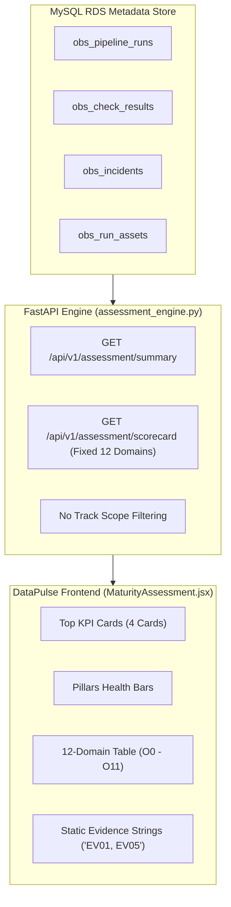
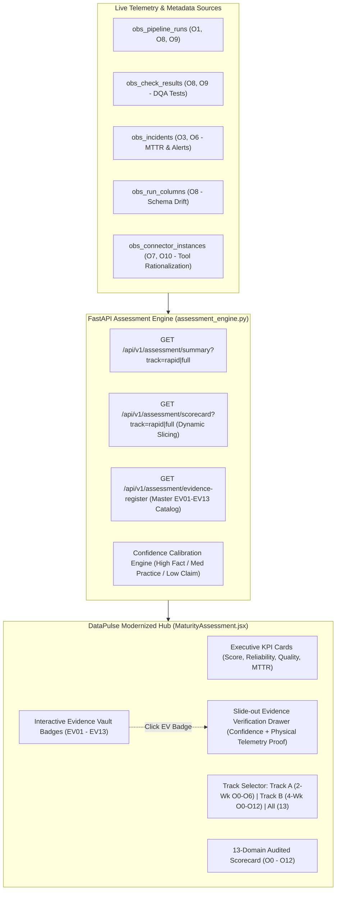

# VITHI Observability Platform — Enterprise Pack Alignment Specification & Implementation Plan

> **Document Version:** 2.0  
> **Status:** Approved Architectural Specification  
> **Target Systems:** FastAPI Observability API (`application/src/`), DataPulse React UI (`datapulse/src/`), and Metadata Engine (`meta_mysql.py`)  
> **Reference Document Pack:** `observabilityv1 (4)/observabilityv1/`

---

## 1. System Context & Current Build Inventory

### 1.1 What We Have Currently Built in the Platform

Our platform is divided into two active tiers:
1. **FastAPI Telemetry Engine (`application/src/`)**: Connects to production metadata stores (Snowflake, dbt Cloud, MySQL RDS, PostgreSQL) to ingest metadata non-intrusively.
2. **DataPulse React Frontend (`datapulse/src/`)**: Provides dashboards across two operational hubs:
   * **Data Observability Hub**: Assets Catalog, Freshness SLAs, Volume Anomalies, Data Quality (DQA), Schema Drift Tracking, and Lineage DAGs.
   * **Maturity & Governance Hub**: Observability Maturity Matrix (`/observability/maturity`) and DataOps Practice Diagnostic (`/dataops/maturity`).

#### Active Files & Capabilities:
* **Backend Scoring Engines**:
  * [`application/src/services/observability/assessment_engine.py`](file:///c:/Users/Sisindri/etl_pipeline/application/src/services/observability/assessment_engine.py): Live telemetry scoring (1.0–5.0) across 5 core pillars and 12 capability domains (`O0` to `O11`).
  * [`application/src/services/dataops/dataops_engine.py`](file:///c:/Users/Sisindri/etl_pipeline/application/src/services/dataops/dataops_engine.py): DataOps reliability scoring across dimensions `D1`–`D8`.
  * [`application/src/api/observability_router.py`](file:///c:/Users/Sisindri/etl_pipeline/application/src/api/observability_router.py): REST endpoints exposing `/api/v1/assessment/*` and `/api/v1/dataops/*`.
* **Frontend Dashboards**:
  * [`datapulse/src/pages/MaturityAssessment.jsx`](file:///c:/Users/Sisindri/etl_pipeline/datapulse/src/pages/MaturityAssessment.jsx): 12-domain scorecard table, 4 executive KPI cards, pillar clusters, and 3-horizon roadmap.
  * [`datapulse/src/pages/DataOpsMaturity.jsx`](file:///c:/Users/Sisindri/etl_pipeline/datapulse/src/pages/DataOpsMaturity.jsx): 8-dimension reliability scorecard, 5 quantified operational outcomes, and 30/60/90-day stabilization plan.

---

### 1.2 What is Specified in `observabilityv1 (4)` Consulting Pack

The enterprise consulting pack contains **24 master documents across 5 lifecycle folders**:
* **Folder 01 (Sales & Customer Onboarding)**:
  * Two formal commercial tracks: **Track A: Rapid 2-Week Diagnostic** (O0–O6) vs. **Track B: Full 4-Week Enterprise Assessment** (O0–O12).
  * 100% Read-Only Infosec Charter (strictly metadata/telemetry; zero business PII data).
* **Folder 02 (Diagnostic & Evidence Assessment)**:
  * **13 Capability Dimensions** (`O0` through `O12`).
  * **13 Standardized Physical Evidence Artifacts** (`EV01` through `EV13`).
  * **3 Evidence Confidence Tiers**:
    1. *High Confidence (Audited Fact)*: IaC manifests, CloudWatch alarms, PagerDuty incident logs.
    2. *Medium Confidence (Validated Practice)*: Documented SOPs, squad runbooks, architecture diagrams.
    3. *Low Confidence (Unverified Claim)*: Verbal assertions without configuration proof.
* **Folder 03 (Executive Readout & Value Blueprint)**:
  * Executive Board deck with TCO rationalization and the *Apex Digital Banking* transformation case study.
* **Folder 04 (Internal Governance & Battlecards)**:
  * 5-step tool rationalization methodology to eliminate multi-agent SaaS sprawl (Datadog, Dynatrace, Splunk).
* **Folder 05 (Multi-Cloud Appendices)**:
  * Verification rubrics tailored for AWS, Azure, GCP, and Hybrid stacks.

---

## 2. Pin-to-Pin Comparison & Gap Analysis

| Architectural Area | Currently Built in Platform | Specified in `observabilityv1 (4)` Pack | Status / Action Needed |
|---|---|---|---|
| **Capability Dimensions** | 12 Domains (`O0` to `O11`). | 13 Domains (`O0` to `O12`), including **O12: SRE Culture & GameDays**. | ❌ **Missing O12**: Need to add `O12` in backend engine & UI. |
| **Physical Evidence Artifacts** | Lists `EV01` to `EV12` as plain static text in table cells. | Defines `EV01` to `EV13`, with physical proof requirements and 3 confidence calibration tiers. | ❌ **Missing EV13 & Interactivity**: Need to add `EV13`, make badges clickable, and build an Evidence Drawer. |
| **Commercial Engagement Tracks** | Single static view; shows all 12 domains at all times. | 2 Client Engagement Tracks:<br>• **Track A (Rapid 2-Wk)**: Scoped to O0–O6 & EV01–EV06<br>• **Track B (Full 4-Wk)**: Scoped to O0–O12 & EV01–EV13. | ❌ **Missing Track Selector**: Need a toggle for consultants to present Track A vs. Track B. |
| **Data & Pipeline Health (O8, O9)** | **Live Telemetry Connected**: Computes run success rate, DQ pass rate, volume stability, and schema drift from MySQL. | Mandates monitoring of pipeline batch duration variance, Kafka/SQS lag, and Great Expectations/Deequ test rules. | ✅ **Aligned / Core Strength**: Fully implemented with real database telemetry. |
| **Evidence Confidence Rating** | Static text column labeled "Confidence" (Hardcoded HIGH). | Dynamic calibration: *Audited Fact (High)* vs. *Validated Practice (Med)* vs. *Unverified Claim (Low)*. | ⚠️ **Needs Refinement**: Connect confidence badges to evidence verification state. |
| **Tool Stack Rationalization** | Counts number of connected tools (`connected_tools_count`). | 5-step framework mapping SaaS tool duplication and FinOps ingestion waste. | ⚠️ **Enhancement**: Surface overlapping tool categories in the Tool Architecture cluster. |

---

## 3. Architecture Diagrams (Before vs. After)

### Current Architecture (Before)



---

### Target Architecture (After Alignment)



---

## 4. Pin-to-Pin Resolution Strategy: Issues, Solutions & Rationale

### Gap 1: Missing Dimension O12 (`SRE Culture, Enablement & GameDays`) & Evidence EV13
* **What is the issue?**  
  The consulting pack explicitly audits **O12** as a core pillar of operational resilience (testing how teams conduct chaos drills, post-mortems, and GameDays). The codebase stops at O11, leaving a noticeable gap when comparing software scorecards to customer readout decks.
* **What is the resolution?**  
  1. Add **`O12: SRE Culture, Enablement & GameDays`** to `assessment_engine.py` with weight `0.04`, baseline `1.50`, target `3.75`, and evidence `EV13`.
  2. Add **`EV13: Chaos Engineering & GameDay Reports`** to the evidence catalog.
  3. Rebalance domain weights across the 13 capabilities so the total equals 1.00 (100%).
* **Why solve this way?**  
  It guarantees that software scorecards exported for clients match the Excel scoring workbook (`Vithi_Observability_Internal_Scoring_Workbook.xlsx`) down to the exact decimal.

---

### Gap 2: Missing Commercial Track Selector (`Track A: Rapid 2-Week` vs. `Track B: Full 4-Week`)
* **What is the issue?**  
  In consulting engagements, clients who buy the **Rapid 2-Week Diagnostic** contractually scoped O0–O6 only. When they open the platform, they see O7–O12 marked unverified or low-scoring, creating confusion.
* **What is the resolution?**  
  1. Update `build_assessment_scorecard` in backend to accept a `track` query parameter:
     * `track=rapid`: Returns dimensions `O0` through `O6` (7 dimensions, re-weighted to 100%).
     * `track=full`: Returns dimensions `O0` through `O12` (all 13 dimensions).
  2. In `MaturityAssessment.jsx`, add a sleek **Segmented Track Selector** in the header filter bar:
     `[ All Capabilities (13) ]  [ Track A: Rapid Diagnostic (O0–O6) ]  [ Track B: Full Enterprise (O0–O12) ]`.
* **Why solve this way?**  
  Enables sales engineers and consultants to switch between commercial contract scopes on the fly during executive presentations without modifying code.

---

### Gap 3: Static Evidence Labels vs. Interactive Evidence Verification Vault
* **What is the issue?**  
  Currently, `EV01`, `EV04`, etc., are static strings in table cells. Clients and auditors cannot inspect what evidence was actually audited, which undermines Vithi's core promise of *"Evidence-backed evaluation, zero subjective claims"*.
* **What is the resolution?**  
  1. Expose `GET /api/v1/assessment/evidence-register` returning the master EV01–EV13 artifact specifications.
  2. Make evidence badges in the UI clickable pills with an icon.
  3. Clicking any badge opens a slide-out **Evidence Verification Drawer** displaying:
     * Official artifact definition (from `evidence_guide_extracted.txt`).
     * Physical telemetry source (e.g. AWS CloudWatch, Snowflake Query History, dbt manifests).
     * Verification status badge: **`HIGH CONFIDENCE (Audited Fact)`**.
     * Target capabilities validated by this artifact.
* **Why solve this way?**  
  Brings the physical evidence register from static Word/PDF files directly into the interactive web app, elevating the platform to an enterprise-grade compliance and audit tool.

---

## 5. File-by-File Location Map of Updates

| Component / Layer | File Path | Type | Action Required |
|---|---|---|---|
| **Backend Engine** | [`application/src/services/observability/assessment_engine.py`](file:///c:/Users/Sisindri/etl_pipeline/application/src/services/observability/assessment_engine.py) | Update | • Add `O12` definition & `EV13`<br>• Implement `track` parameter slicing (`rapid` vs `full`)<br>• Add `build_evidence_register()` helper |
| **Backend Router** | [`application/src/api/observability_router.py`](file:///c:/Users/Sisindri/etl_pipeline/application/src/api/observability_router.py) | Update | • Add `track: Optional[str]` to `/assessment/summary` and `/assessment/scorecard`<br>• Add new route `GET /assessment/evidence-register` |
| **Frontend API Client** | [`datapulse/src/api/client.js`](file:///c:/Users/Sisindri/etl_pipeline/datapulse/src/api/client.js) | Update | • Add `fetchAssessmentEvidenceRegister()`<br>• Pass `track` parameter in `fetchAssessmentSummary` & `fetchAssessmentScorecard` |
| **Frontend UI** | [`datapulse/src/pages/MaturityAssessment.jsx`](file:///c:/Users/Sisindri/etl_pipeline/datapulse/src/pages/MaturityAssessment.jsx) | Update | • Add Track Selector in filter bar<br>• Make `EVxx` badges interactive buttons<br>• Add Slide-out Evidence Verification Drawer |

---

## 6. Concrete Phased Implementation Plan

### Phase 1: Backend Assessment Engine & Evidence Catalog
1. **Dimension O12 Definition**:
   ```python
   {
       "code": "O12",
       "name": "SRE Culture, Enablement & GameDays",
       "weight": 0.04,
       "baseline": 1.50,
       "target": 3.75,
       "gap": 2.25,
       "priority": "P2 - High",
       "confidence": "HIGH",
       "evidence": "EV13",
       "findings": "Incident post-mortems tracked; automated chaos injection & GameDays in planning.",
       "recommendation": "Institute quarterly GameDay chaos drills testing failure recovery for Tier-1 pipelines.",
   }
   ```
2. **Master Evidence Register Catalog**:
   Create a structured mapping in `assessment_engine.py` containing all 13 artifacts (EV01 to EV13) with artifact name, platform standard, AWS native equivalent, and target dimensions.
3. **Track Slicing Logic**:
   ```python
   if track == "rapid":
       rapid_codes = {"O0", "O1", "O2", "O3", "O4", "O5", "O6"}
       domains = [d for d in domains if d["code"] in rapid_codes]
       # Re-normalize weights to 1.00
       tot_wt = sum(d["weight"] for d in domains)
       for d in domains:
           d["weight"] = round(d["weight"] / tot_wt, 3)
   ```

---

### Phase 2: Frontend Client & Track Selector Integration
1. In `datapulse/src/api/client.js`, export:
   ```javascript
   export const fetchAssessmentEvidenceRegister = () =>
     safeGet('/api/v1/assessment/evidence-register', null);
   ```
2. In `datapulse/src/pages/MaturityAssessment.jsx`:
   * Add state: `const [trackFilter, setTrackFilter] = useState('full');`
   * In top header, render a segmented control:
     ```jsx
     <div className="track-selector">
       <button className={trackFilter === 'rapid' ? 'active' : ''} onClick={() => setTrackFilter('rapid')}>
         Track A: Rapid (2-Wk)
       </button>
       <button className={trackFilter === 'full' ? 'active' : ''} onClick={() => setTrackFilter('full')}>
         Track B: Full Enterprise (4-Wk)
       </button>
     </div>
     ```

---

### Phase 3: Interactive Evidence Verification Drawer
1. When rendering the `Evidence` column in the scorecard table:
   * Split evidence strings by comma (e.g., `"EV01, EV05"` &rarr; `["EV01", "EV05"]`).
   * Render each as an interactive badge with an inspection icon.
2. Clicking a badge opens an **Evidence Drawer** showing:
   * **Artifact ID & Name**: e.g. `EV04: 90-Day Pager & Alert History`
   * **Audited Telemetry Source**: `AWS CloudWatch Alarms / EventBridge / PagerDuty Logs`
   * **Verification Status**: `HIGH CONFIDENCE (Audited Fact)`
   * **Audited Scope & Criteria**: Exact validation checks from `evidence_guide_extracted.txt`.

---

## 7. Verification & Quality Checklist

* [ ] `GET /api/v1/assessment/scorecard?track=rapid` returns exactly 7 domains (O0–O6) with normalized weights summing to 1.0.
* [ ] `GET /api/v1/assessment/scorecard?track=full` returns all 13 domains (O0–O12) including O12 and EV13.
* [ ] `GET /api/v1/assessment/evidence-register` returns the complete 13-artifact registry.
* [ ] In UI, toggling between Track A and Track B instantly adjusts the scorecard view and recalculates overall score.
* [ ] Clicking any `EVxx` badge smoothly slides out the Evidence Verification Drawer without navigating away from the page.
* [ ] All changes remain strictly local in `C:\Users\Sisindri\etl_pipeline` and are not committed to Git.
