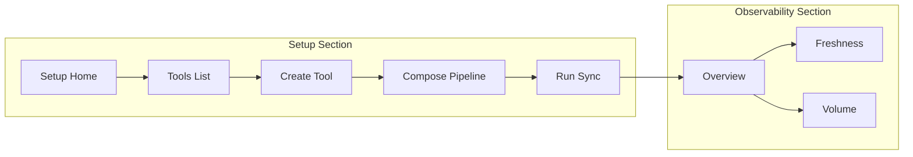

# Setup UI Specification

Frontend handoff document for **VITHI Data Observability** setup/configuration pages.

These pages are **admin/setup** flows — separate from the existing monitoring views (Overview, Freshness, Volume, Schema, etc.). They wire to the backend APIs in [`application/src/app.py`](../application/src/app.py).

**Related docs:** [`CONNECTORS.md`](CONNECTORS.md) · [`METADATA_FIELDS.md`](METADATA_FIELDS.md) · [`DEPLOY_EC2.md`](DEPLOY_EC2.md) · [`DASHBOARD_API.md`](DASHBOARD_API.md) · Live OpenAPI: `{API_BASE}/docs`

---

## 1. Overview

### 1.1 Purpose

Give workspace admins a UI to:

1. Register **database** and **ETL/orchestrator** tools (with encrypted secrets)
2. **Compose pipelines** from those tools (source → ETL → target)
3. **Run Sync** to collect metadata into MySQL
4. Verify data appears on the **Overview** dashboard

### 1.2 End-to-end flow

```
Register SOURCE DB tool
  → Register TARGET DB tool
  → Register ETL tool (dbt)
  → Test each tool
  → Compose pipeline
  → Run Sync
  → Verify Overview KPIs
```



### 1.3 API base URL

| Environment | Example |
|-------------|---------|
| Local | `http://127.0.0.1:8002` |
| EC2 | `http://<host>:8002` |

Frontend env var: `VITE_API_BASE` (or equivalent).

**Auth:** None today. Reserve an optional `Authorization` header slot for future use.

### 1.4 Response conventions

| Case | Shape |
|------|-------|
| Success | `{ "ok": true, ... }` |
| Client error | HTTP 400/403/404 with `{ "detail": "message" }` |
| Server error | HTTP 500 with `{ "detail": "message" }` |
| Test failure (200) | `{ "ok": false, "tool_id": "...", "result": {...}, "error_code": "...", "detail": "..." }` |

**Secrets:** Plaintext passwords/tokens are **never** returned by GET APIs. Use `has_secret: true|false` only.

---

## 2. Navigation and routes

Add a sidebar group **Setup** (place above **Settings** or as a subsection inside it).

| # | Route | Sidebar label | Purpose |
|---|-------|---------------|---------|
| 1 | `/setup` | Setup | Progress checklist + quick actions |
| 2 | `/setup/tools` | Tools | List and filter registered tools |
| 3 | `/setup/tools/new` | Add Tool | Create tool (connector picker + dynamic form) |
| 4 | `/setup/tools/:toolId` | (detail) | Tool detail, test, rotate secret |
| 5 | `/setup/pipelines/compose` | Compose Pipeline | Build pipeline from tool IDs |
| 6 | `/setup/pipelines` | Pipelines | List pipelines + bindings |
| 7 | `/setup/sync` | Run Sync | Trigger sync + show result |

**Breadcrumbs example:** `Setup / Tools / sf-analytics-raw`

**Design alignment:** Match existing VITHI shell — left sidebar, top filter bar, card-based content, dark mode toggle (see Overview screenshot).

---

## 3. Shared components

| Component | Usage |
|-----------|-------|
| `PageHeader` | Title, subtitle, primary CTA |
| `FilterBar` | Kind / connector_type dropdowns on list pages |
| `DataTable` | Sortable columns, row actions |
| `StatusBadge` | `active`, `has_secret`, test pass/fail |
| `SecretField` | Masked password input; never pre-fill on edit |
| `JsonPreview` | Read-only formatted config on detail page |
| `TestResultPanel` | Expandable success/error from test API |
| `ErrorAlert` | Show `detail` from 4xx/5xx |
| `StepChecklist` | Setup home progress tracker |
| `ConnectorPicker` | Cards from `GET /v1/tools/types` |

### 3.1 Design tokens (suggested)

Reuse existing dashboard tokens:

- Primary action: green (matches Export button)
- Success badge: green
- Warning: amber (`has_secret: false`)
- Error: red
- Card padding: 16–24px
- Table row hover: subtle highlight

---

## 4. Page specifications

### 4.1 Setup Home — `/setup`

**Purpose:** Onboarding checklist and shortcuts.

#### Layout

```
┌─────────────────────────────────────────────────────────────┐
│ Setup                                            [Refresh]  │
├─────────────────────────────────────────────────────────────┤
│ ┌─ Progress ─────────────────────────────────────────────┐  │
│ │ [✓] Source database tool                               │  │
│ │ [✓] Target database tool                               │  │
│ │ [ ] ETL tool (dbt)                                     │  │
│ │ [ ] Pipeline composed                                  │  │
│ │ [ ] First sync completed                               │  │
│ └────────────────────────────────────────────────────────┘  │
│ ┌─ Quick actions ────────────────────────────────────────┐  │
│ │ [Add Tool]  [Compose Pipeline]  [Run Sync]             │  │
│ └────────────────────────────────────────────────────────┘  │
│ ┌─ Registered tools (summary) ───────────────────────────┐  │
│ │ 3 tools · 1 pipeline · last sync: —                    │  │
│ └────────────────────────────────────────────────────────┘  │
└─────────────────────────────────────────────────────────────┘
```

#### APIs on load

| Call | Purpose |
|------|---------|
| `GET /v1/tools` | Count by kind; detect source/target/ETL |
| `GET /v1/pipelines` | Pipeline exists |
| `GET /api/v1/overview?range=all` (optional) | Runs > 0 → sync done |

#### Step completion rules

| Step | Complete when |
|------|---------------|
| Source database tool | ≥1 tool with `kind=database` (user marks role or naming convention) |
| Target database tool | ≥1 additional database tool OR same tool if single-DB demo |
| ETL tool | ≥1 tool with `kind=etl` or `kind=orchestrator` |
| Pipeline composed | `GET /v1/pipelines` returns non-empty array |
| First sync | Overview shows runs OR last sync response `ok: true` |

#### Actions

| Button | Navigates to |
|--------|--------------|
| Add Tool | `/setup/tools/new` |
| Compose Pipeline | `/setup/pipelines/compose` |
| Run Sync | `/setup/sync` |
| View Overview | `/` (existing app) |

#### Empty state

"No tools configured yet. Start by adding a source database tool."

---

### 4.2 Tools List — `/setup/tools`

**Purpose:** Browse, filter, and manage registered tools.

#### Layout

```
┌─────────────────────────────────────────────────────────────┐
│ Tools                                    [+ Add Tool]         │
├─────────────────────────────────────────────────────────────┤
│ Kind: [All ▼]   Connector: [All ▼]   Search: [________]     │
├─────────────────────────────────────────────────────────────┤
│ Name          │ Type      │ Kind       │ Secret │ Updated   │
│ sf-raw        │ snowflake │ database   │ ✓      │ 2026-…    │
│ dbt-orders    │ dbt       │ etl        │ ✓      │ 2026-…    │
└─────────────────────────────────────────────────────────────┘
```

#### API

```
GET /v1/tools?kind={database|etl|orchestrator}&connector_type={snowflake|dbt|...}
```

#### Table columns

| Column | Field | Notes |
|--------|-------|-------|
| Name | `name` | Link to detail |
| Connector | `connector_type` | Badge |
| Kind | `kind` | `database` \| `etl` \| `orchestrator` |
| Secret | `has_secret` | ✓ green / ⚠ missing |
| Status | `status` | Usually `active` |
| Updated | `updated_at` | Relative time |
| Actions | — | View · Test · Delete (future) |

#### Filters

- **Kind:** maps to `?kind=`
- **Connector:** maps to `?connector_type=`

#### Row actions

| Action | API |
|--------|-----|
| View | Navigate `/setup/tools/{tool_id}` |
| Test | `POST /v1/tools/{tool_id}/test` inline modal |

#### Empty state

"No tools yet. Add your first database or ETL connector."

#### Error state

Show `ErrorAlert` with `detail` on 500.

---

### 4.3 Create Tool — `/setup/tools/new`

**Purpose:** Register a reusable connector with config + secret.

#### Layout (two steps)

**Step A — Pick connector**

```
GET /v1/tools/types → render cards grouped by kind

[ Snowflake ]  [ MySQL ]  [ PostgreSQL ]  [ Redshift ]  [ BigQuery ]
[ dbt Cloud ]  [ Airbyte ]  [ Airflow ]
```

**Step B — Dynamic form**

Fields depend on selected `connector_type` (see Section 6).

Common fields for all types:

| Field | API key | Required | Widget |
|-------|---------|----------|--------|
| Display name | `name` | yes | text |
| Connector type | `connector_type` | yes | hidden (from step A) |
| Kind | `kind` | auto | hidden (inferred or from catalog) |
| Secret | `secret` | yes* | SecretField |
| Secret slot | `secret_name` | no | select, default `default` |
| Legacy env fallback | `auth_ref` | no | text (advanced) |
| Tool ID | `tool_id` | no | hidden (omit to mint UUID) |

\*BigQuery may use `credentials_path` instead of inline secret.

#### Submit

```
POST /v1/tools
Content-Type: application/json
```

On success → redirect to `/setup/tools/{tool_id}` with toast "Tool saved. Test connection recommended."

On success response:

```json
{
  "ok": true,
  "tool": { "tool_id": "...", "name": "...", "has_secret": true, ... },
  "secret_stored": true
}
```

#### Validation (client-side)

- Required config fields per connector schema
- `tables`: comma-separated input → split to `string[]`, trim whitespace
- Block submit if `secret` empty (unless BigQuery with credentials_path)
- Show inline errors from 400/500 `detail`

#### Post-create CTA

"Test connection" → `POST /v1/tools/{tool_id}/test`

---

### 4.4 Tool Detail — `/setup/tools/:toolId`

**Purpose:** Inspect config, test connection, rotate secret.

#### API on load

```
GET /v1/tools/{tool_id}
```

#### Layout

```
┌─────────────────────────────────────────────────────────────┐
│ ← Tools    sf-analytics-raw                    [Test]       │
├─────────────────────────────────────────────────────────────┤
│ Connector: snowflake   Kind: database   Secret: ✓ stored    │
├─────────────────────────────────────────────────────────────┤
│ Configuration (read-only)                                   │
│ { "account_id": "...", "schema": "RAW", "tables": [...] }   │
├─────────────────────────────────────────────────────────────┤
│ [Rotate Secret]  [Use in Pipeline →]                        │
├─────────────────────────────────────────────────────────────┤
│ Test result panel (after Test click)                        │
└─────────────────────────────────────────────────────────────┘
```

#### Actions

| Button | API | Body |
|--------|-----|------|
| Test Connection | `POST /v1/tools/{tool_id}/test` | — |
| Rotate Secret | `PUT /v1/tools/{tool_id}/secret` | `{ "secret": "...", "secret_name": "default" }` |

#### Test success response

```json
{
  "ok": true,
  "tool_id": "aaaaaaaa-bbbb-cccc-dddd-eeeeeeeeeeee",
  "result": { "ok": true, "message": "Connected" }
}
```

#### Test failure response (HTTP 200, ok false)

```json
{
  "ok": false,
  "tool_id": "...",
  "result": { "ok": false, "message": "..." },
  "error_code": "connection_failed",
  "error_hint": "...",
  "detail": "..."
}
```

Show Snowflake/dbt classified hints when present.

#### Rotate secret modal

- Single SecretField
- Submit → PUT; on success update `has_secret` badge
- Never show previous secret value

#### 404

Redirect to tools list with "Tool not found."

---

### 4.5 Compose Pipeline — `/setup/pipelines/compose`

**Purpose:** Link source DB tool(s) + ETL tool + target DB tool(s) into one pipeline.

#### APIs on load

```
GET /v1/tools?kind=database   → source/target pickers
GET /v1/tools?kind=etl        → ETL picker (include orchestrator in a second fetch or combined client filter)
```

#### Layout

```
┌─────────────────────────────────────────────────────────────┐
│ Compose Pipeline                                            │
├─────────────────────────────────────────────────────────────┤
│ Pipeline name *     [ orders_etl                    ]       │
│ Description         [ optional                      ]       │
│                                                             │
│ Source tools *      [ multi-select database tools   ▼ ]     │
│ ETL tool *          [ single select etl/orchestrator ▼ ]    │
│ Target tools *      [ multi-select database tools   ▼ ]     │
│                                                             │
│ [x] Set as active pipeline (Sync default)                   │
│                                                             │
│                              [Cancel]  [Create Pipeline]    │
└─────────────────────────────────────────────────────────────┘
```

#### Form → API mapping

| Form field | API key | Type |
|------------|---------|------|
| Pipeline name | `pipeline_name` | string, required |
| Description | `description` | string, optional |
| Source tools | `source_tool_ids` | string[], required |
| ETL tool | `etl_tool_id` | string, required |
| Target tools | `target_tool_ids` | string[], required |
| Active | `make_active` | boolean, default `true` |
| Pipeline ID | `pipeline_id` | omit to auto-mint UUID |

Legacy single-ID fields (`source_tool_id`, `target_tool_id`) still work but prefer arrays.

#### Submit

```
POST /v1/pipelines/from-tools
```

#### Example payload

```json
{
  "pipeline_name": "orders_etl",
  "source_tool_ids": ["11111111-2222-3333-4444-555555555555"],
  "etl_tool_id": "66666666-7777-8888-9999-000000000000",
  "target_tool_ids": ["aaaaaaaa-bbbb-cccc-dddd-eeeeeeeeeeee"],
  "make_active": true,
  "description": "Orders raw → dbt → staging"
}
```

#### Success response

```json
{
  "ok": true,
  "pipeline_id": "...",
  "pipeline_name": "orders_etl",
  "is_active": true,
  "source_tool_ids": ["..."],
  "etl_tool_id": "...",
  "target_tool_ids": ["..."],
  "message": "Pipeline composed from tools; Sync will use bindings."
}
```

On success → redirect `/setup/sync?pipeline_id=...` or show "Run first sync" CTA.

#### Validation UX

| Condition | UI behavior |
|-----------|-------------|
| Selected tool `has_secret: false` | Warning icon; block submit |
| Empty source or target | Inline error before submit |
| HTTP 403 | "Pipeline limit reached" + link to docs |
| HTTP 400 | Show `detail` (e.g. tool not found, wrong kind) |

**Note:** Composing a pipeline auto-seeds default monitors and DQ rules server-side.

---

### 4.6 Pipelines List — `/setup/pipelines`

**Purpose:** View registered pipelines and tool bindings.

#### API

```
GET /v1/pipelines
GET /api/v1/pipelines/{pipeline_id}/bindings   (detail expand)
```

#### Table columns

| Column | Source |
|--------|--------|
| Name | `pipeline_name` |
| Active | `is_active` badge |
| Source | `source_tool` / binding SOURCE tools |
| ETL | `etl_tool` |
| Target | `target_tool` / binding TARGET tools |
| Updated | `updated_at` |
| Actions | Compose similar · Run Sync |

#### Bindings detail (expand row or side panel)

```
GET /api/v1/pipelines/{pipeline_id}/bindings
```

Expected binding roles: `SOURCE`, `ETL`, `TARGET` with `instance_id`, `asset_selector_json`.

#### Empty state

"No pipelines. Compose one from your registered tools."

#### Actions

| Button | Action |
|--------|--------|
| Run Sync | Navigate `/setup/sync?pipeline_id=...` |
| Compose new | `/setup/pipelines/compose` |

---

### 4.7 Run Sync — `/setup/sync`

**Purpose:** Manually trigger metadata collection for a pipeline.

#### APIs on load

```
GET /v1/pipelines          → pipeline picker
GET /v1/pipelines/current  → pre-select active (optional; 404 if none)
```

#### Layout

```
┌─────────────────────────────────────────────────────────────┐
│ Run Sync                                                    │
├─────────────────────────────────────────────────────────────┤
│ Pipeline *        [ orders_etl                        ▼ ]   │
│                                                             │
│ Advanced ▼                                                  │
│   dbt run id      [ optional exact run id             ]     │
│   [x] Force DB refresh (ignore snapshot cache)              │
│                                                             │
│                                    [Run Sync]               │
├─────────────────────────────────────────────────────────────┤
│ Result (after submit)                                       │
│ Run ID: ...   Status: success   Source assets: 3            │
│ Target assets: 5   [View Overview →]                        │
└─────────────────────────────────────────────────────────────┘
```

#### Submit

```
POST /v1/sync
```

#### Example payloads

By name:

```json
{ "pipeline_name": "orders_etl" }
```

By ID with refresh:

```json
{
  "pipeline_id": "aaaaaaaa-bbbb-cccc-dddd-eeeeeeeeeeee",
  "refresh_db": true
}
```

With exact dbt run (no silent fallback to latest):

```json
{
  "pipeline_id": "...",
  "dbt_run_id": "123456789"
}
```

Omit both `pipeline_id` and `pipeline_name` to sync the **active** pipeline default.

#### Success response (abbreviated)

```json
{
  "ok": true,
  "message": "Sync completed (tools/bindings)",
  "pipeline_id": "...",
  "pipeline_name": "orders_etl",
  "run_id": "...",
  "status": "success",
  "source_count": 3,
  "target_count": 5,
  "rows_read": 1000,
  "rows_written": 950,
  "dbt_tests_stored": 12,
  "lineage_edges_stored": 8,
  "stored": true
}
```

#### Failure cases

| HTTP | Meaning | UI |
|------|---------|-----|
| 404 | Pipeline not found | ErrorAlert |
| 404 | No ETL runs | "No runs found for ETL tool" |
| 400 | dbt_run_id not found | Show detail; do not retry silently |
| 500 | Connector/store error | ErrorAlert + expandable detail |

#### Post-sync CTA

"View Overview" → existing dashboard; KPIs should show pipeline runs and health pillars.

---

## 5. Setup API reference

### 5.1 Tools

| Action | Method | Path | Request body |
|--------|--------|------|--------------|
| Connector catalog | GET | `/v1/tools/types` | — |
| List tools | GET | `/v1/tools` | Query: `kind`, `connector_type` |
| Get tool | GET | `/v1/tools/{tool_id}` | — |
| Create / update | POST | `/v1/tools` | `CreateToolRequest` |
| Rotate secret | PUT | `/v1/tools/{tool_id}/secret` | `{ secret, secret_name? }` |
| Test | POST | `/v1/tools/{tool_id}/test` | — |

#### Tool object (GET list / detail)

```json
{
  "tool_id": "aaaaaaaa-bbbb-cccc-dddd-eeeeeeeeeeee",
  "instance_id": "aaaaaaaa-bbbb-cccc-dddd-eeeeeeeeeeee",
  "connection_id": "conn-snowflake-xy12345",
  "name": "sf-analytics-raw",
  "connector_type": "snowflake",
  "kind": "database",
  "config": {
    "account_id": "xy12345.us-east-1",
    "user_id": "OBS_USER",
    "warehouse_id": "COMPUTE_WH",
    "database_id": "ANALYTICS_DB",
    "schema": "RAW",
    "tables": ["RAW_ORDERS"],
    "sf_role": "ACCOUNTADMIN"
  },
  "auth_ref": null,
  "has_secret": true,
  "status": "active",
  "created_at": "2026-03-20T10:00:00",
  "updated_at": "2026-03-20T10:00:00"
}
```

#### Connector catalog item

```json
{ "id": "snowflake", "kind": "database", "label": "Snowflake" }
```

### 5.2 Pipelines

| Action | Method | Path | Request body |
|--------|--------|------|--------------|
| Compose | POST | `/v1/pipelines/from-tools` | `ComposePipelineRequest` |
| List | GET | `/v1/pipelines` | — |
| Active pipeline | GET | `/v1/pipelines/current` | — |
| Bindings | GET | `/api/v1/pipelines/{pipeline_id}/bindings` | — |
| Legacy templates | GET | `/v1/pipelines/templates` | — |

#### Pipeline list row

```json
{
  "pipeline_id": "...",
  "pipeline_name": "orders_etl",
  "source_tool": "snowflake",
  "source_schema": "RAW",
  "etl_tool": "dbt",
  "target_tool": "snowflake",
  "target_schema": "STAGING",
  "is_active": 1,
  "updated_at": "2026-03-20T12:00:00"
}
```

### 5.3 Sync

| Action | Method | Path | Request body |
|--------|--------|------|--------------|
| Run sync | POST | `/v1/sync` | `SyncRequest` |

---

## 6. Connector form schemas and payloads

Dynamic forms: render fields from tables below. Map UI → `POST /v1/tools` body.

### 6.1 Field mapping rules

| UI pattern | JSON |
|------------|------|
| Tables (comma-separated) | `"tables": ["T1", "T2"]` |
| Port number | integer in config |
| Secret password | top-level `"secret"`, **not** inside `config` |
| Optional tool ID on create | omit `tool_id` to mint UUID |

### 6.2 Snowflake (`database`)

| Field | Config key | Required | Notes |
|-------|------------|----------|-------|
| Account | `account_id` | yes | e.g. `xy12345.us-east-1` |
| User | `user_id` | yes | |
| Warehouse | `warehouse_id` | yes | |
| Database | `database_id` | yes | |
| Schema | `schema` | yes | |
| Tables | `tables` | yes | array; pipeline grain |
| Role | `sf_role` | yes | e.g. `ACCOUNTADMIN` |
| Password | `secret` | yes | top-level |

```json
{
  "name": "sf-analytics-raw",
  "connector_type": "snowflake",
  "kind": "database",
  "secret": "<password>",
  "config": {
    "account_id": "xy12345.us-east-1",
    "user_id": "OBS_USER",
    "warehouse_id": "COMPUTE_WH",
    "database_id": "ANALYTICS_DB",
    "schema": "RAW",
    "tables": ["RAW_ORDERS", "RAW_CUSTOMERS"],
    "sf_role": "ACCOUNTADMIN"
  }
}
```

**Typical roles:** SOURCE tool → raw schema; TARGET tool → staging/mart schema.

---

### 6.3 MySQL (`database`)

| Field | Config key | Required |
|-------|------------|----------|
| Host | `host` | yes |
| Port | `port` | yes (default 3306) |
| User | `user` | yes |
| Database | `database` | yes |
| Schema | `schema` | yes |
| Tables | `tables` | yes |
| Password | `secret` | yes |

```json
{
  "name": "mysql-raw-source",
  "connector_type": "mysql",
  "kind": "database",
  "secret": "<password>",
  "config": {
    "host": "127.0.0.1",
    "port": 3306,
    "user": "obs_user",
    "database": "ecommerce",
    "schema": "src_data",
    "tables": ["orders", "customers"]
  }
}
```

---

### 6.4 PostgreSQL / Amazon Redshift (`database`)

| Field | Config key | Required |
|-------|------------|----------|
| Host | `host` | yes |
| Port | `port` | yes (5432 / 5439) |
| User | `user` | yes |
| Database | `database` | yes |
| Schema | `schema` | yes |
| Tables | `tables` | yes |
| Password | `secret` | yes |

```json
{
  "name": "postgres-staging-target",
  "connector_type": "postgres",
  "kind": "database",
  "secret": "<password>",
  "config": {
    "host": "db.example.com",
    "port": 5432,
    "user": "obs_reader",
    "database": "analytics",
    "schema": "staging",
    "tables": ["stg_orders", "stg_customers"]
  }
}
```

Use `"connector_type": "redshift"` with port `5439` for Redshift.

---

### 6.5 Google BigQuery (`database`)

| Field | Config key | Required |
|-------|------------|----------|
| Project | `project_id` | yes |
| Dataset | `dataset` | yes |
| Location | `location` | yes (e.g. `US`) |
| Tables | `tables` | yes |
| Credentials path | `credentials_path` | yes* |
| API token | `secret` | optional |

\*Service account JSON file path on the API host (not uploaded through UI unless you add file upload later).

```json
{
  "name": "bq-analytics-target",
  "connector_type": "bigquery",
  "kind": "database",
  "config": {
    "project_id": "my-gcp-project",
    "dataset": "analytics_marts",
    "location": "US",
    "tables": ["fct_orders"],
    "credentials_path": "/secrets/bq-sa.json"
  }
}
```

---

### 6.6 dbt Cloud (`etl`)

| Field | Config key | Required |
|-------|------------|----------|
| Account ID | `account_id` | yes |
| Project ID | `project_id` | yes |
| Job ID | `job_id` | yes |
| Project name | `project_name` | recommended |
| API base | `api_base` | yes |
| API token | `secret` | yes |

```json
{
  "name": "dbt-orders-job",
  "connector_type": "dbt",
  "kind": "etl",
  "secret": "<dbt-cloud-api-token>",
  "config": {
    "account_id": "12345",
    "project_id": "67890",
    "job_id": "111",
    "project_name": "analytics",
    "api_base": "https://cloud.getdbt.com/api/v2"
  }
}
```

`dbt_cloud` is an alias for `dbt`.

---

### 6.7 Airbyte (`etl`)

| Field | Config key | Required |
|-------|------------|----------|
| Base URL | `base_url` | yes |
| Workspace ID | `workspace_id` | recommended |
| Connection ID | `connection_id` | recommended |
| Client ID | `client_id` | optional |
| Client secret | `client_secret` | optional (or use `secret`) |
| Username / password | `username` | optional (basic auth) |

```json
{
  "name": "airbyte-ecommerce",
  "connector_type": "airbyte",
  "kind": "etl",
  "secret": "<client_secret_or_password>",
  "config": {
    "base_url": "https://cloud.airbyte.com",
    "workspace_id": "...",
    "connection_id": "...",
    "client_id": "...",
    "client_secret": "..."
  }
}
```

---

### 6.8 Apache Airflow (`orchestrator`)

| Field | Config key | Required |
|-------|------------|----------|
| Base URL | `base_url` | yes |
| DAG ID | `dag_id` | recommended |
| Token | `secret` | optional (Bearer) |
| Username | `username` | optional (basic auth) |

```json
{
  "name": "airflow-daily-etl",
  "connector_type": "airflow",
  "kind": "orchestrator",
  "secret": "<bearer_token_or_password>",
  "config": {
    "base_url": "https://airflow.example.com",
    "dag_id": "orders_daily",
    "username": "admin"
  }
}
```

Airflow tools can be used as `etl_tool_id` in compose (kind `etl` or `orchestrator` accepted).

---

## 7. Error and edge cases

| Scenario | HTTP | UI handling |
|----------|------|-------------|
| Tool not found | 404 | Redirect + toast |
| Pipeline not found | 404 | ErrorAlert on sync |
| Freemium pipeline limit | 403 | Banner: raise `FREEMIUM_MAX_PIPELINES` or delete unused |
| Missing source/target on compose | 400 | Inline validation |
| Wrong tool kind (ETL as source) | 400 | Show server `detail` |
| Test connection failed | 200, `ok:false` | TestResultPanel red; show `error_code`, `detail` |
| Missing secret before test/sync | — | Amber banner on tool row / block compose submit |
| Invalid pipeline_id placeholder | 400 | Only if user manually enters UUID field |
| Sync: no ETL runs | 200, `ok:false` | "No runs found for ETL tool" |
| Sync: dbt_run_id mismatch | 404/400 | Show detail; user must pick valid run |

**Security UX:**

- Never log or display `secret` after submit
- Mask secret inputs; no "show password" in production build optional
- Config JSON on detail page must not contain password keys (server strips them)

---

## 8. Post-setup verification

After first successful sync, confirm on **Overview** (`GET /api/v1/overview`):

| Widget | Expected after setup |
|--------|---------------------|
| Total Pipelines | ≥ 1 |
| Successful Runs | > 0% if dbt run succeeded |
| Pipeline Runs Over Time | Points appear |
| Data Observability Health | Pillars populate (freshness, volume, data_quality, schema, consistency, uniqueness) |
| Pipeline Monitoring table | Pipeline row with runs |

Deep links:

| Pillar | Route |
|--------|-------|
| Freshness | `/observability/freshness` |
| Volume | `/observability/volume` |
| Data Quality | `/observability/quality` |
| Schema | `/observability/schema` |

---

## 9. Phase 2 — Monitors and DQ rules (optional)

Not required for initial onboarding; add when users need custom checks beyond auto-seeded defaults.

### 9.1 Monitors — `/setup/monitors`

| Action | Method | Path |
|--------|--------|------|
| List | GET | `/v1/monitors?pipeline_id=&monitor_kind=` |
| Get | GET | `/v1/monitors/{monitor_id}` |
| Create | POST | `/v1/monitors` |
| Update | PUT | `/v1/monitors/{monitor_id}` |
| Delete | DELETE | `/v1/monitors/{monitor_id}` |

**Create monitor example:**

```json
{
  "pipeline_id": "...",
  "name": "Orders volume drop",
  "monitor_kind": "volume_drop",
  "config": { "threshold_pct": 20 },
  "is_enabled": true
}
```

**Monitor kinds:** `freshness`, `volume_drop`, `pipeline_failure`, `dbt_test_failure`, `null_check`, `unique_check`, `duplicate_check`, `custom_sql`

**Manual evaluation:** `POST /api/v1/ops/evaluate-monitors`

### 9.2 DQ rules — `/setup/dq-rules`

| Action | Method | Path |
|--------|--------|------|
| List | GET | `/v1/dq-rules?pipeline_id=` |
| Get | GET | `/v1/dq-rules/{rule_id}` |
| Create | POST | `/v1/dq-rules` |
| Update | PUT | `/v1/dq-rules/{rule_id}` |
| Delete | DELETE | `/v1/dq-rules/{rule_id}` |

**Create DQ rule example:**

```json
{
  "pipeline_id": "...",
  "rule_name": "order_id not null",
  "rule_type": "NOT_NULL",
  "dataset_id": "ANALYTICS_DB.STAGING.STG_ORDERS",
  "column_name": "order_id",
  "severity": "high",
  "is_enabled": true,
  "evaluation_trigger": "poller"
}
```

**Rule types:** `NOT_NULL`, `UNIQUE`, `DUPLICATE`, `ACCEPTED_VALUES`, `RANGE`, `CUSTOM_SQL`

**Manual evaluation:** `POST /api/v1/ops/evaluate-dq-rules`

### 9.3 Phase 2 UI notes

- Filter monitors/rules by pipeline (same picker as Sync page)
- Pre-fill `dataset_id` from pipeline TARGET tables when possible
- Link from pipeline detail → "Manage DQ rules"
- Default monitors/rules are created on compose; this UI is for **edit/add**

---

## 10. Suggested frontend API client

Thin wrapper (TypeScript example):

```typescript
const BASE = import.meta.env.VITE_API_BASE;

async function api<T>(path: string, init?: RequestInit): Promise<T> {
  const res = await fetch(`${BASE}${path}`, {
    headers: { "Content-Type": "application/json", ...init?.headers },
    ...init,
  });
  if (!res.ok) {
    const err = await res.json().catch(() => ({}));
    throw new Error(err.detail || res.statusText);
  }
  return res.json();
}

export const setupApi = {
  listConnectorTypes: () => api("/v1/tools/types"),
  listTools: (q?: { kind?: string; connector_type?: string }) =>
    api(`/v1/tools?${new URLSearchParams(q as Record<string, string>)}`),
  getTool: (id: string) => api(`/v1/tools/${id}`),
  createTool: (body: unknown) => api("/v1/tools", { method: "POST", body: JSON.stringify(body) }),
  testTool: (id: string) => api(`/v1/tools/${id}/test`, { method: "POST" }),
  rotateSecret: (id: string, secret: string) =>
    api(`/v1/tools/${id}/secret`, { method: "PUT", body: JSON.stringify({ secret }) }),
  composePipeline: (body: unknown) =>
    api("/v1/pipelines/from-tools", { method: "POST", body: JSON.stringify(body) }),
  listPipelines: () => api("/v1/pipelines"),
  runSync: (body: unknown) => api("/v1/sync", { method: "POST", body: JSON.stringify(body) }),
};
```

---

## 11. Implementation checklist (for developers)

- [ ] Add Setup sidebar group and 7 routes
- [ ] Implement shared components (Section 3)
- [ ] Tools list + filters wired to `GET /v1/tools`
- [ ] Create tool with connector-specific dynamic forms (Section 6)
- [ ] Tool detail: test + rotate secret
- [ ] Compose pipeline with multi-select and secret validation
- [ ] Sync page with result panel
- [ ] Setup home checklist driven by API state
- [ ] Error handling per Section 7
- [ ] Post-sync link to Overview
- [ ] (Phase 2) Monitors and DQ rules pages

---

## 12. Complete happy-path example (copy-paste sequence)

Replace UUIDs after each create response.

```bash
# 1. Source Snowflake
curl -s -X POST "$API/v1/tools" -H "Content-Type: application/json" -d '{
  "name": "sf-raw-source",
  "connector_type": "snowflake",
  "kind": "database",
  "secret": "YOUR_PASSWORD",
  "config": {
    "account_id": "xy12345.us-east-1",
    "user_id": "OBS_USER",
    "warehouse_id": "COMPUTE_WH",
    "database_id": "ANALYTICS_DB",
    "schema": "RAW",
    "tables": ["RAW_ORDERS"],
    "sf_role": "ACCOUNTADMIN"
  }
}'

# 2. Target Snowflake
curl -s -X POST "$API/v1/tools" -H "Content-Type: application/json" -d '{
  "name": "sf-staging-target",
  "connector_type": "snowflake",
  "kind": "database",
  "secret": "YOUR_PASSWORD",
  "config": {
    "account_id": "xy12345.us-east-1",
    "user_id": "OBS_USER",
    "warehouse_id": "COMPUTE_WH",
    "database_id": "ANALYTICS_DB",
    "schema": "STAGING",
    "tables": ["STG_ORDERS"],
    "sf_role": "ACCOUNTADMIN"
  }
}'

# 3. dbt ETL
curl -s -X POST "$API/v1/tools" -H "Content-Type: application/json" -d '{
  "name": "dbt-orders-job",
  "connector_type": "dbt",
  "kind": "etl",
  "secret": "YOUR_DBT_TOKEN",
  "config": {
    "account_id": "12345",
    "project_id": "67890",
    "job_id": "111",
    "project_name": "analytics",
    "api_base": "https://cloud.getdbt.com/api/v2"
  }
}'

# 4. Test tools
curl -s -X POST "$API/v1/tools/{source_tool_id}/test"
curl -s -X POST "$API/v1/tools/{target_tool_id}/test"
curl -s -X POST "$API/v1/tools/{etl_tool_id}/test"

# 5. Compose pipeline
curl -s -X POST "$API/v1/pipelines/from-tools" -H "Content-Type: application/json" -d '{
  "pipeline_name": "orders_etl",
  "source_tool_ids": ["{source_tool_id}"],
  "etl_tool_id": "{etl_tool_id}",
  "target_tool_ids": ["{target_tool_id}"],
  "make_active": true
}'

# 6. Sync
curl -s -X POST "$API/v1/sync" -H "Content-Type: application/json" -d '{
  "pipeline_name": "orders_etl"
}'

# 7. Verify overview
curl -s "$API/api/v1/overview?range=7d"
```

This sequence is what the Setup UI should enable without raw curl.
