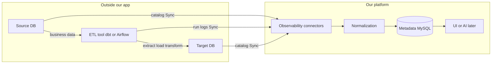
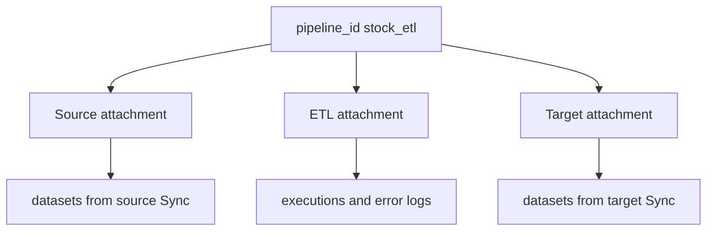
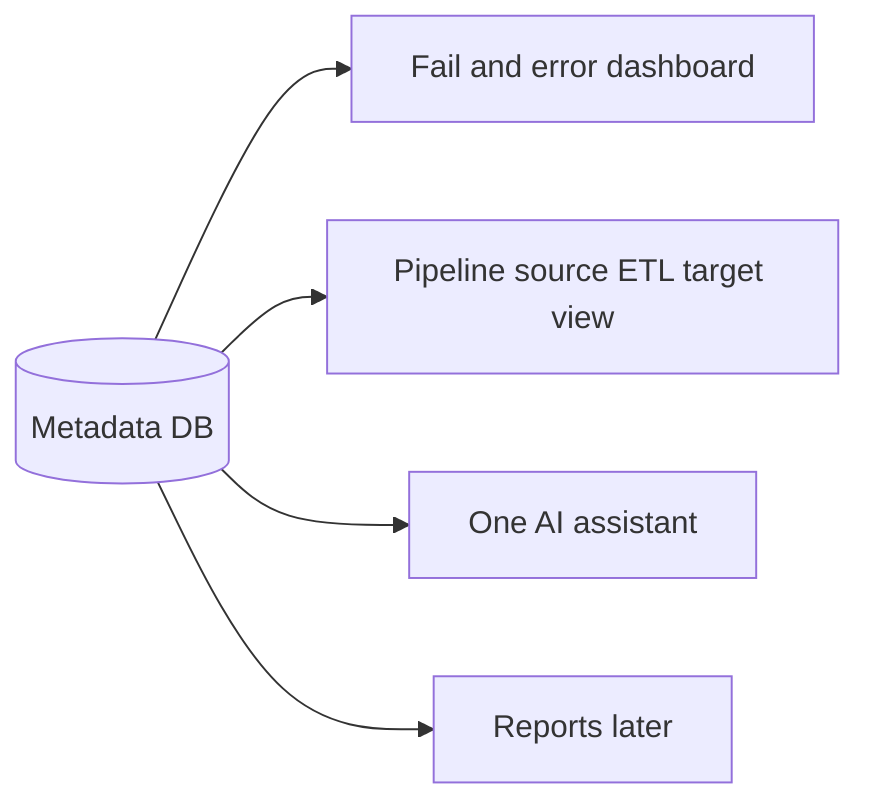

# End-to-end architecture (simple guide)

**Audience:** teammates who need a clear picture — connectors, what we store, how a pipeline is identified.  
**Length:** short (~5–6 pages). No heavy theory.

---

## 1. What we are building (one sentence)

We do **not** rebuild ETL. We **watch** databases and ETL tools, **normalize** their metadata and logs, and **store** them in **one Metadata database** so we can see, for each pipeline: source, ETL tool, target, and errors.

```text
Open ETL tools (dbt / Airflow) move the data.
Our platform stores the story of that data movement.
```

---

## 2. Big picture architecture



### Point-wise

1. **Source DB / Target DB** — real warehouses (e.g. Snowflake). Business data lives there.
2. **ETL tool** — dbt or Airflow. It already has extract/load connectors. It runs the pipeline.
3. **Our connectors** — thin readers. They Sync metadata and logs **into** our DB. They do not move business rows.
4. **Normalization** — turns each tool’s messy JSON into one standard shape.
5. **Metadata MySQL** — one place for pipelines, tables, runs, errors, links.
6. **UI / AI** — later read only Metadata (not live Snowflake at chat time).

### Two meanings of “connector” (important)

| Kind | Who owns it | Job |
|------|-------------|-----|
| ETL extract/load connectors | dbt / Airflow | Move data source → target |
| Our observability connectors | Our platform | Collect metadata + logs into Metadata DB |

---

## 3. How a pipeline is recognized (pipeline_id)

You create one **pipeline** and attach three things:

```text
pipeline_id = stock_etl

  ├── Source DB connector   (e.g. Snowflake → RAW tables)
  ├── ETL tool connector    (e.g. dbt Cloud)
  └── Target DB connector   (e.g. Snowflake → STAGING tables)
```



### Point-wise

1. **pipeline_id** is the folder name for one data flow.
2. Usual MVP: **1 ETL + 2 DB roles** (source + target). Same Snowflake account can be both roles with different schemas.
3. After Sync, you ask: “for `stock_etl`, show source tables, target tables, last failures.”
4. Linking is stored in **`etl_pipeline_io`** (and connector attachments). Without this link, Snowflake and dbt stay as separate piles of data.

---

## 4. How connectors work (day-to-day)

```text
1. Save connection in UI (account, project, …)
2. Password / token stays in .env (not in MySQL)
3. Test  → credentials work?
4. Sync → pull → normalize → store in Metadata
```

| Connector | Pulls from | Main result in our DB |
|-----------|------------|------------------------|
| Snowflake | `INFORMATION_SCHEMA` | Tables, row_count, last_updated |
| dbt Cloud | Runs API / artifacts | Job status, error_message |
| Airflow (later) | REST / metadata DB | DAG/task runs, errors |
| MySQL (later) | information_schema | Tables like Snowflake |

### Point-wise

1. **Test** only checks login.
2. **Sync** is how “real-time” works for us: poll after jobs run (or on a schedule later).
3. Secrets never go in the database — only env var names.
4. Assistants never call Snowflake/dbt directly; they read Metadata.

---

## 5. Two transforms (do not confuse them)

| Transform | Where | What it does |
|-----------|--------|----------------|
| **Business ETL transform** | Inside dbt/Airflow | Clean/join business rows |
| **Metadata transform** | Our **Normalization** | Raw logs/catalog → structured Metadata tables |

R&D for us = better mapping rules and source/target linking — **not** replacing dbt SQL.

---

## 6. What we store — clear tables and columns

All tables live in one MySQL database (e.g. `metadata`). Prefix: `etl_`.

### A. Connections (how we reach tools)

**Table: `etl_connector_instances`**

| Column | Meaning |
|--------|---------|
| `tenant_id` | Customer/space (e.g. `demo`) |
| `instance_id` | Unique connection id |
| `tool_id` | `snowflake` / `dbt` / `airflow` |
| `name` | Display name |
| `config` | Non-secret settings (account, database, …) |
| `secrets_ref` | Env var **names** only |
| `status` | created / ready / synced / error |
| `last_sync_at` | Last successful Sync |
| `last_error` | Last error text |

### B. Pipeline identity

**Table: `etl_pipelines`**

| Column | Meaning |
|--------|---------|
| `tenant_id` | Space |
| `pipeline_id` | Our id (e.g. `stock_etl`) |
| `name` | Human name |
| `source_tool` | Main ETL tool (`dbt`, …) |
| `status` | Latest known status |

**Table: `etl_pipeline_io`** (source ↔ target for a pipeline)

| Column | Meaning |
|--------|---------|
| `tenant_id` | Space |
| `pipeline_id` | Which pipeline |
| `upstream_dataset_id` | Source table id |
| `downstream_dataset_id` | Target table id |
| `source_tool` | Tool that declared the link |

### C. From databases (Snowflake / MySQL) — table metadata

**Table: `etl_datasets`**

| Column | Meaning |
|--------|---------|
| `tenant_id` | Space |
| `dataset_id` | Full name e.g. `ANALYTICS_DB.RAW.STOCK_DATA_RAW` |
| `name` | Short table name |
| `database_name` | Database |
| `schema_name` | Schema |
| `platform` | `snowflake` / `mysql` |
| `row_count` | Approx rows (for volume later) |
| `last_updated_at` | Last change time (for freshness later) |

**Table: `etl_dataset_columns`** (optional / later for schema diff)

| Column | Meaning |
|--------|---------|
| `dataset_id` | Parent table |
| `column_name` | Column |
| `data_type` | Type (VARCHAR, NUMBER, …) |
| `is_nullable` | Null allowed? |

### D. From ETL tools — run logs

**Table: `etl_executions`**

| Column | Meaning |
|--------|---------|
| `tenant_id` | Space |
| `execution_id` | Run id from the tool |
| `pipeline_id` | Which pipeline |
| `task_id` | Step/model if any |
| `source_tool` | `dbt` / `airflow` |
| `status` | succeeded / failed / running |
| `started_at` | Start time |
| `finished_at` | End time |
| `error_message` | **The log / error text** |
| `attempt` | Retry number |

### E. Optional later (not required for MVP screens)

| Table | Use |
|-------|-----|
| `etl_monitors` / `etl_check_results` | Freshness / volume checks |
| `etl_lineage_edges` | Table → table graph |
| `etl_incidents` / `etl_alerts` | Grouped open problems |

**MVP focus:** connections + pipelines + pipeline_io + datasets + executions (with `error_message`).

---

## 7. Example: one real pipeline

```text
pipeline_id: stock_etl

Source dataset:  ANALYTICS_DB.RAW.STOCK_DATA_RAW
ETL:             dbt Cloud project (runs stored in etl_executions)
Target dataset:  ANALYTICS_DB.STAGING_STAGING.STG_STOCK_DATA
```

```text
Sync Snowflake  →  rows in etl_datasets
Sync dbt        →  rows in etl_executions (status + error_message)
Link            →  row in etl_pipeline_io
```

Then you can answer:

- How many runs failed for `stock_etl`?
- What was the error?
- Which source and target tables belong to it?

---

## 8. Freshness (short — later, not MVP UI)

**Freshness** = “is the **table** updated recently enough?” using `last_updated_at` vs a time rule.

- Needed when a job looks **green** but the target table is still **old**.
- For now you can skip it in product talk; still **store** `last_updated_at` / `row_count` so you can compute later.
- Failed pipeline counts come from **`etl_executions`**, not from freshness.

---

## 9. What we can do using this Metadata DB

Once data is stored, we can:

1. **List pipelines** and show running / failed counts.
2. **Open a pipeline** and see source DB, ETL tool, target DB.
3. **Show error logs** from `error_message` without opening dbt Cloud.
4. **List tables** discovered from Snowflake Sync.
5. **Filter everything by `pipeline_id`.**
6. **Feed one AI assistant** with tools that only query Metadata.
7. **Later:** reports (BIRT / Superset) on fail rates; freshness/volume; lineage UI (Marquez optional).
8. **Later:** schema diff when column types change between Syncs.



---

## 10. Point-wise summary (whole story)

1. ETL tools run pipelines; we observe them.
2. Each tool type has an observability connector (Snowflake, dbt, …).
3. Sync pulls metadata/logs; Normalization standardizes them.
4. Everything lands in one MySQL Metadata DB.
5. A **pipeline_id** attaches source DB + ETL + target DB.
6. DB connectors fill **datasets**; ETL connectors fill **executions** (logs).
7. **pipeline_io** links source table → target table for that pipeline.
8. MVP UI: fails, errors, attachments — not freshness-first.
9. AI and reports sit **on Metadata**, not on live tools.
10. We do not rebuild extract/load; we store the story so people and AI can understand it.

---

## Related docs

- Folder index: [README.md](./README.md)
- Connectors how-to: [02-connectors.md](./02-connectors.md)
- Credentials checklist: [07-credentials-checklist.md](./07-credentials-checklist.md)
- Full entity catalog: [../METADATA_LAYER.md](../METADATA_LAYER.md)
