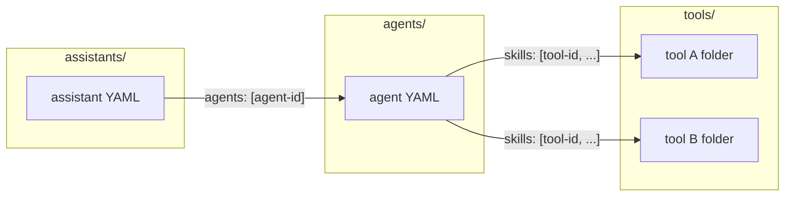

​# Developing ResMate Use Cases with the CLI

This document is a standalone reference for developing use cases on the ResMate agent platform using the ResMate CLI. It covers folder layout, YAML semantics, how agents connect to tools and assistants to agents, environment configuration, CLI operations (push and pull), and how to write system context, agent instructions, and JS tool handlers.

---

## Prerequisites

- **ResMate CLI** – Built and available as `resmate` in your path (Rust project under repo root).
- **Configuration** – Set up via a `.env` file in the project root (or cwd) or via a config file. See [Environment and .env](#environment-and-env) below.

---

## Environment and .env

The CLI loads configuration from the environment. A `.env` file in the project root (or cwd) is loaded at startup. Config can also be read from a YAML file (path from `RESMATE_CONFIG` or default `~/.resmate/config.yaml`); **environment variables override** the config file.

### Allowed properties (environment variables)


| Variable                 | Purpose                                                                  | Required / Default                                  |
| ------------------------ | ------------------------------------------------------------------------ | --------------------------------------------------- |
| `RESMATE_BASE_URL`       | API base URL for the ResMate platform.                                   | Optional; default: `https://api-dev.ai.resmed.com`. |
| `RESMATE_API_KEY`        | API key (or JWT) for authenticating requests.                            | **Required** for push/pull and `config validate`.   |
| `RESMATE_SECRET`         | Secret used to sign JWTs for API calls (when using JWT auth).            | Required when the client uses JWT.                  |
| `RESMATE_ROC_SESSION`    | Optional ROC session value.                                              | Optional.                                           |
| `RESMATE_CONFIG`         | Path to a YAML config file (overrides default `~/.resmate/config.yaml`). | Optional.                                           |
| `RESMATE_IDS_FILE`       | Path to the IDs store file (slug → id mapping).                          | Optional; default: `~/.resmate/ids.yaml`.           |
| `RESMATE_TOOLS_DIR`      | Directory containing tool folders.                                       | Optional; default: `tools` under cwd.               |
| `RESMATE_AGENTS_DIR`     | Directory containing agent YAML files.                                   | Optional; default: `agents` under cwd.              |
| `RESMATE_ASSISTANTS_DIR` | Directory containing assistant YAML files.                               | Optional; default: `assistants` under cwd.          |


### How to use .env to achieve the use case workflow

1. Create a `.env` file in the repo root (or cwd) with at least:
  - `RESMATE_API_KEY=<your-api-key>`
  - `RESMATE_SECRET=<your-secret>` (if your setup uses JWT auth)
2. Optionally set `RESMATE_BASE_URL` for a different environment (e.g. production).
3. Optionally set `RESMATE_TOOLS_DIR`, `RESMATE_AGENTS_DIR`, `RESMATE_ASSISTANTS_DIR` if your folders live elsewhere.
4. Run `resmate config show` to verify base_url and that api_key is set.
5. Run `resmate config validate` to check connectivity.
6. Use **push** to upload tools/agents/assistants and **pull** to sync from the platform.

**Note:** `.env` is in `.gitignore`; do not commit secrets.

---

## CLI operations (push and pull)

The primary workflow is **push** (local → platform) and **pull** (platform → local). Only these operations are documented here.

### Tools


| Command                                         | Description                                                                                                                                                                                                                                                    |
| ----------------------------------------------- | -------------------------------------------------------------------------------------------------------------------------------------------------------------------------------------------------------------------------------------------------------------- |
| `resmate tool push <name> [--tools-dir <PATH>]` | Loads `tools/<name>/` (or `<PATH>/<name>/`): `tool.yaml` + handler (and `package.json` for non-JS). If YAML has no `id`, creates the tool via API and writes the new `id` back to the YAML; if `id` is present, updates the tool. Output: `Pushed tool: <id>`. |
| `resmate tool pull <name> [--tools-dir <PATH>]` | Requires `id` in `tools/<name>/tool.yaml`. Fetches the tool from the API and overwrites local YAML, handler, and (if present) `package.json`. Output: `Pulled tool: <name>`.                                                                                   |


### Agents


| Command                                           | Description                                                                                                                                   |
| ------------------------------------------------- | --------------------------------------------------------------------------------------------------------------------------------------------- |
| `resmate agent push <name> [--agents-dir <PATH>]` | Loads `agents/<name>.yaml` (or `<PATH>/<name>.yaml`). No `id` → create and write `id` back; with `id` → update. Output: `Pushed agent: <id>`. |
| `resmate agent pull <name> [--agents-dir <PATH>]` | Requires `id` in the agent YAML. Fetches the agent and overwrites the local YAML. Output: `Pulled agent: <name>`.                             |


### Assistants


| Command                                                   | Description                                                                                                                   |
| --------------------------------------------------------- | ----------------------------------------------------------------------------------------------------------------------------- |
| `resmate assistant push <name> [--assistants-dir <PATH>]` | Loads `assistants/<name>.yaml`. No `id` → create and write `id` back; with `id` → update. Output: `Pushed assistant: <id>`.   |
| `resmate assistant pull <name> [--assistants-dir <PATH>]` | Requires `id` in the assistant YAML. Fetches the assistant and overwrites the local YAML. Output: `Pulled assistant: <name>`. |


### Config


| Command                   | Description                                                                                    |
| ------------------------- | ---------------------------------------------------------------------------------------------- |
| `resmate config show`     | Print current config (base_url, masked api_key, roc_session, config file path, env var names). |
| `resmate config validate` | Validate base URL and API key with a test request.                                             |


Directory overrides (`--tools-dir`, `--agents-dir`, `--assistants-dir`) align with the env vars `RESMATE_TOOLS_DIR`, `RESMATE_AGENTS_DIR`, `RESMATE_ASSISTANTS_DIR` when not passed.

---

## Architecture and connections

### Folder layout

- `**tools/<name>/`** – One folder per tool. Contains:
  - `**tool.yaml**` (or `tool.yml`, `config.yaml`): metadata and spec; `**id**` is the stable tool ID.
  - **Handler:** `handler.js`, `index.js`, `handler.ts`, or `index.ts`. For **type: JS** no `package.json` is required; for other types (e.g. FAAS), `package.json` is required.
- `**agents/<name>.yaml`** – One file per agent. `**id**` = agent ID; `**skills**` = list of **tool IDs** (from `tools/*/tool.yaml`).
- `**assistants/<name>.yaml`** – One file per assistant. `**id**` = assistant ID; `**agents**` = list of **agent IDs** (from `agents/*.yaml`).

### Connection rules

- **Agent → Tools:** In `agents/<name>.yaml`, the `**skills`** array must list **tool IDs**. Each value must match the `id` in the corresponding `tools/<folder>/tool.yaml`.
- **Assistant → Agents:** In `assistants/<name>.yaml`, the `**agents`** array must list **agent IDs**. Each value must match the `id` in the corresponding `agents/<name>.yaml`.




### End-to-end flow (writing a use case)

1. Define **tools** (folder + `tool.yaml` + handler); record each tool’s `id`.
2. Define **agent** (`agents/<name>.yaml`) with `skills` = those tool IDs; write **system instructions** (role, when to use each tool, order, rules).
3. Define **assistant** (`assistants/<name>.yaml`) with `agents` = that agent’s ID; write **system context** (what the assistant is, which agent/tools, scope, errors).

---

## Folder and file reference

### Tools

- **Location:** `tools/<name>/` (or `RESMATE_TOOLS_DIR/<name>/`).
- **Required files:** A single YAML file (`tool.yaml`, `tool.yml`, `config.yaml`, or `config.yml`) and a handler file (`handler.js`, `index.js`, `handler.ts`, or `index.ts`). For type other than **JS**, `package.json` is also required.

**Key fields in tool YAML:**


| Field                | Description                                                                                                                                          |
| -------------------- | ---------------------------------------------------------------------------------------------------------------------------------------------------- |
| `id`                 | Stable tool ID (written back after first push if missing).                                                                                           |
| `name`               | Display name of the tool.                                                                                                                            |
| `description`        | Short description.                                                                                                                                   |
| `type`               | e.g. `JS` or `FAAS`. **JS** = no `package.json`; FAAS = code + `package.json`.                                                                       |
| `input_modes`        | e.g. `text/plain`, `application/json`.                                                                                                               |
| `output_modes`       | e.g. `text/plain`, `application/json`.                                                                                                               |
| `systemInstructions` | **List of strings** (array); when to use the tool, input/output contract, quality rules. The API expects an array, not a single multiline string.    |
| `arguments`          | **Object (map):** each key = argument name; value = `{ type, required, description }`. Do not use a list of `{ name, type, required, description }`. |
| `examples`           | Optional list of example prompts.                                                                                                                    |
| `tags`               | Optional list of tags.                                                                                                                               |


**Required fields for API (tools):** The create/update API may require `version` (e.g. `"1.0"`), `createdBy` (e.g. `""`), and `managedBy` (array, e.g. `[]`). Include these if push fails with missing field errors.

**Arguments format (key-value object):**

```yaml
arguments:
  supplierName:
    type: string
    required: true
    description: Supplier name or partial name to search for
  limit:
    type: number
    required: false
    description: Maximum number of results to return (optional)
```

### Agents

- **Location:** `agents/<name>.yaml` or `agents/<name>.yml` (or under `RESMATE_AGENTS_DIR`).

**Key fields in agent YAML:**


| Field                | Description                                                      |
| -------------------- | ---------------------------------------------------------------- |
| `id`                 | Stable agent ID (written back after first push if missing).      |
| `name`               | Display name.                                                    |
| `slug`               | Slug identifier.                                                 |
| `description`        | Short description.                                               |
| `systemInstructions` | List of strings; role, tool order, when to use each tool, rules. |
| `skills`             | **List of tool IDs** (must match `id` in `tools/*/tool.yaml`).   |
| `is_public`          | Boolean.                                                         |
| `roles`              | List of role identifiers.                                        |


**Required fields for API (agents):** Include `slug`, `version` (e.g. `"1.0"`), `createdBy` (e.g. `""`), `managedBy` (array, e.g. `[]`), and `admins` (array, e.g. `[]`) when the API requires them. **systemInstructions** must be a list of strings, not a multiline string.

Other fields (e.g. `guardrailsContext`) may appear; see `agents/code-forge.yaml` and `src/specs/agent.rs` for canonical key order.

### Assistants

- **Location:** `assistants/<name>.yaml` or `assistants/<name>.yml` (or under `RESMATE_ASSISTANTS_DIR`).

**Key fields in assistant YAML:**


| Field                         | Description                                                                                                                                                                                                                                 |
| ----------------------------- | ------------------------------------------------------------------------------------------------------------------------------------------------------------------------------------------------------------------------------------------- |
| `id`                          | Stable assistant ID (written back after first push if missing).                                                                                                                                                                             |
| `name`                        | Display name.                                                                                                                                                                                                                               |
| `slug`                        | Slug identifier.                                                                                                                                                                                                                            |
| `description`                 | Short description.                                                                                                                                                                                                                          |
| `status`                      | e.g. `active`.                                                                                                                                                                                                                              |
| `visibility`                  | e.g. `private`.                                                                                                                                                                                                                             |
| `agents`                      | **List of agent IDs** (must match `id` in `agents/*.yaml`).                                                                                                                                                                                 |
| `systemContext`               | String; what the assistant is, which agent/tools, scope, error handling.                                                                                                                                                                    |
| `guardrailsContext`           | Optional. String context passed to the **guardrail server** to verify whether the user's question or requested operation is allowed. Describe allowed operations and scope; the guardrail server uses this to accept or reject the request. |
| `guardrailsViolationFallback` | Optional. **Fallback message** shown to the user when the guardrail server rejects the request (guardrails violation). Use a short, user-friendly message that explains what the assistant can do instead.                                  |


**Guardrails (assistant):** To restrict what users can ask or do, set **guardrailsContext** (context sent to the guardrail server for validation) and **guardrailsViolationFallback** (message shown when the request is rejected). The guardrail server evaluates the user question/operation against the context and allows or rejects it; on rejection, the user sees the fallback message. When the assistant uses HITL cards or forms, include in **guardrailsContext** that HITL submission messages (card confirm/cancel and form submissions with field data) are allowed so they are not rejected.

**Required fields for API (assistants):** Include `slug`, `version`, `createdBy`, `managedBy`, `admins`, `status` (e.g. `active`), and `visibility` (e.g. `private`) when the API requires them. Quote **description** if it contains a colon to avoid YAML parsing issues.

---

## Step-by-step use case checklist

1. **Create tool folder(s):** For each tool, create `tools/<name>/` with `tool.yaml` and `handler.js` (or other allowed handler name). Set `type: JS` if no `package.json`; otherwise include `package.json`. Leave `id` empty for a new tool (CLI will write it on first push).
2. **Create or update agent YAML:** Create or edit `agents/<name>.yaml`. Set `**skills`** to the list of **tool IDs** (from each `tools/<folder>/tool.yaml` `id`). Write **system instructions**: role, tool order, when to use each tool, rules.
3. **Create or update assistant YAML:** Create or edit `assistants/<name>.yaml`. Set `**agents`** to the list of **agent IDs** (from `agents/*.yaml`). Write **system context**: what the assistant is, which agent/tools, scope, error handling.
4. **Push:** Run `resmate tool push <name>` for each tool, then `resmate agent push <name>`, then `resmate assistant push <name>`.
5. **Pull (when needed):** To refresh local YAML/handlers from the platform after changes elsewhere, use `resmate tool pull <name>`, `resmate agent pull <name>`, `resmate assistant pull <name>`.

---

## System context vs system instructions

- **Assistant `systemContext`:** Identity (what this assistant is), which agent (and tools) it uses, scope (in-scope vs out-of-scope), and how to handle errors (e.g. do not expose internals). Keep it short and token-efficient; avoid long trigger/greeting/flow details that belong in the agent.
- **Agent `systemInstructions`:** Role, **order** of tools, **when** to call each tool, and rules (e.g. do not call code-gen before form submit). Be precise and step-oriented.
- **Tool `systemInstructions`:** Input/output contract, **when** this tool is used in the flow (e.g. “only after user has submitted the HITL form”), and quality/fallback rules. Align with the agent’s flow.

---

## JS tool handlers (and “fast” services)

- **Handler contract:** The handler is a **script**, not a function. Do **not** wrap code in `function handler(context) { ... }`. The platform injects `context` (e.g. `context?.input` with the tool arguments) and executes the script. Start directly with `try { ... } catch (e) { ... }`. Return a **JSON string** (e.g. `return JSON.stringify({ success, message, ... })`). On error, return a JSON object with `success: false` and an `error` message.
- **Optional `agentResponseContext`:** The handler can include an `agentResponseContext` string in the returned JSON; the platform can pass this to the agent to guide how to present the tool result (e.g. “Just return the code block to the user”).
- **Platform APIs:** Handlers may use platform-provided APIs such as `askLLMStructuredOutput` (for LLM calls with a schema) and `queryRecords` (for data queries). See `tools/code-forge-hitl/handler.js`, `tools/api-code-generator/handler.js`, and `tools/pr-supplier-search/handler.js` for patterns.
- **Type JS vs FAAS:** For **type: JS**, no `package.json` is required; the CLI only uploads the handler code. For **FAAS**, the CLI expects `package.json` and uploads both code and package.json.

Reference implementations:

- [tools/code-forge-hitl/handler.js](../tools/code-forge-hitl/handler.js) – Compose HITL config using LLM and queryRecords, return config + agentResponseContext.
- [tools/api-code-generator/handler.js](../tools/api-code-generator/handler.js) – Generate PL/SQL using askLLMStructuredOutput, return apiCode/fallback and agentResponseContext.
- [tools/pr-supplier-search/handler.js](../tools/pr-supplier-search/handler.js) – Script-style handler (try/catch, no function wrapper); fetches HITL config via queryRecords and returns HITL response shape.

### Tools that return HITL config

When a tool returns a HITL config so the platform can show an adaptive card to the user:

1. **Tool name:** The tool **name** in `tool.yaml` must end with **"HITLConfig"** (e.g. "PR Supplier Search HITLConfig") so the platform recognizes the response and displays the HITL.
2. **Fetch config:** In the handler, use `queryRecords([{ collectionName: "hitlConfig", query: { slug: "<hitl-slug>" } }])`. Use the slug that matches your `hitl/<name>/meta.yaml` (e.g. `pr-supplier-confirm`). The record has `config` (JSON string), `preMessage`, `postMessage`.
3. **Placeholders in config:** In the HITL card JSON (e.g. `hitl/<name>/config.json`), use placeholders such as `"value": "${supplierName}"` or `"value": "${supplierId}"` in FactSet, TextBlock, or other fields where dynamic data should appear.
4. **Substitute in handler:** The frontend renders the card from the **config** object only; it does not perform placeholder substitution. In the handler, **replace placeholders inside the config** (e.g. recursively over the parsed config object, replacing `${supplierName}`, `${supplierId}`, etc. with actual values) before returning. Return the **substituted** config so the card shows real data (e.g. supplier name and ID) to the user.
5. **Return shape:** Return `JSON.stringify({ success, message, config: JSON.stringify(config), preMessage: record?.preMessage, postMessage: record?.postMessage, values: { ... }, agentResponseContext? })`. Use the substituted `config`; include **values** (e.g. `supplierName`, `supplierId`) for reference and audit—the platform does not use `values` to fill the card; the card is filled by the config you return.
6. **Missing record:** If no HITL record is found, return a fallback response without `config`, `preMessage`, or `postMessage` so the agent still receives useful data (e.g. search results).

Example: [tools/pr-supplier-search/](../tools/pr-supplier-search/) (PR Supplier Search HITLConfig) — substitutes `${supplierName}` and `${supplierId}` in the config and returns `values` for audit.

---

## FAAS Tool Type and Runtime SDKs

### Overview of FAAS Tools

**FAAS** (Function as a Service) tools are containerized JavaScript/TypeScript functions that run in a dedicated Node.js runtime environment. Unlike **type: JS** tools (which run in a "fast" script environment), FAAS tools:

- Run in a Docker container with a full Node.js runtime
- Support `package.json` dependencies (npm packages)
- Have access to pre-configured **Runtime SDKs** for internal services
- Require both **handler code** and `**package.json`** when pushed via CLI

**When to use FAAS:**

- When you need npm package dependencies beyond the standard library
- When you need access to Smriti database, vector search, or secrets management
- When you need longer execution time or more complex logic
- When you want to use TypeScript with full compilation support

**When to use JS (fast services):**

- Simple scripts with no external dependencies
- Quick data transformations or API calls
- Platform API usage only (askLLMStructuredOutput, queryRecords)

### Runtime SDKs

FAAS tools have zero-configuration access to internal services through pre-configured **Runtime SDKs**. These SDKs are pre-installed in the container at `/runtime/runtime-sdks/` and automatically initialized with environment variables.

#### Smriti SDK - Pre-configured Client

The Smriti SDK provides access to database operations, vector search, and secrets management.

**Simple Usage (Recommended):**

```javascript
import { smriti } from "/runtime/runtime-sdks/smriti.js";

// Example: Query database records
try {
  const records = await smriti.db.queryRecords({
    documentqueries: [{
      collection: "memories",
      query: { status: "active" },
      options: { limit: 10 }
    }]
  });
  
  return JSON.stringify({ 
    success: true, 
    data: records 
  });
} catch (error) {
  return JSON.stringify({ 
    success: false, 
    error: error.message 
  });
}
```

**Advanced Usage (Custom Configuration):**

```javascript
import { SmritiClient } from "/runtime/runtime-sdks/smriti.js";

// Create custom client with different base URL or headers
const customClient = new SmritiClient({
  baseUrl: "https://custom-smriti.example.com",
  headers: { "X-Custom-Header": "value" }
});

const result = await customClient.db.getRecord({
  collection: "users",
  id: "user-123"
});
```

**Environment Variables:**

- `SMRITI_BASE_URL` - Base URL for Smriti service (default: `http://localhost:6222`)

---

### Smriti SDK Modules

The Smriti SDK provides three modules: **db** (database), **vector** (vector search), and **secrets** (secrets management).

#### 1. Database Module (`smriti.db`)

Complete CRUD operations and hybrid vector-metadata search.

##### createCollection

Create a new database collection.

```javascript
await smriti.db.createCollection({
  collection: "users"
});
```

**Returns:** `{ success: true }` or error

##### createRecord

Insert a new record into a collection.

```javascript
await smriti.db.createRecord({
  collection: "users",
  payload: {
    name: "John Doe",
    email: "john@example.com",
    status: "active"
  }
});
```

**Arguments:**

- `collection` (string, required): Collection name
- `payload` (object, required): Record data

**Returns:** Created record with `_id`

##### getRecord

Retrieve a single record by ID.

```javascript
const record = await smriti.db.getRecord({
  collection: "users",
  id: "user-123"
});
```

**Arguments:**

- `collection` (string, required): Collection name
- `id` (string, required): Record ID

**Returns:** Record object or null if not found

##### queryRecords

Query records with filters and options.

```javascript
const results = await smriti.db.queryRecords({
  documentqueries: [{
    collection: "users",
    query: { 
      status: "active",
      role: "admin"
    },
    options: {
      limit: 50,
      sort: { createdAt: -1 },
      projection: { name: 1, email: 1 }
    }
  }]
});
```

**Arguments:**

- `documentqueries` (array, required): Array of query objects
  - `collection` (string): Collection name
  - `query` (object): MongoDB-style query filter
  - `options` (object, optional): Query options (limit, sort, projection, skip)

**Returns:** Array of matching records

##### updateRecord

Update a record by ID.

```javascript
await smriti.db.updateRecord({
  collection: "users",
  id: "user-123",
  document: {
    status: "inactive",
    updatedAt: new Date().toISOString()
  }
});
```

**Arguments:**

- `collection` (string, required): Collection name
- `id` (string, required): Record ID
- `document` (object, required): Update data (replaces fields)

**Returns:** Updated record

##### updateRecordByField

Update records matching a field value.

```javascript
await smriti.db.updateRecordByField({
  collection: "users",
  field: "email",
  value: "john@example.com",
  data: {
    verified: true,
    verifiedAt: new Date().toISOString()
  }
});
```

**Arguments:**

- `collection` (string, required): Collection name
- `field` (string, required): Field name to match
- `value` (any, required): Field value to match
- `data` (object, required): Update data

**Returns:** Update result with count of modified records

##### deleteRecord

Delete a record by ID.

```javascript
await smriti.db.deleteRecord({
  collection: "users",
  id: "user-123"
});
```

**Arguments:**

- `collection` (string, required): Collection name
- `id` (string, required): Record ID

**Returns:** Deletion result

##### queryVectorHybrid

Hybrid search combining vector similarity and metadata filters.

```javascript
const results = await smriti.db.queryVectorHybrid({
  collection: "documents",
  vector: [0.1, 0.2, 0.3, ...], // 1536-dimensional embedding
  metadataQuery: {
    category: "technical",
    status: "published"
  },
  vectorweight: 0.7,  // 70% weight to vector similarity
  metadataweight: 0.3, // 30% weight to metadata match
  topk: 10  // Return top 10 results
});
```

**Arguments:**

- `collection` (string, required): Collection name
- `vector` (array, required): Query embedding vector
- `metadataQuery` (object, optional): MongoDB-style metadata filter
- `vectorweight` (number, optional): Weight for vector similarity (0-1, default: 0.5)
- `metadataweight` (number, optional): Weight for metadata match (0-1, default: 0.5)
- `topk` (number, optional): Number of results (default: 10)

**Returns:** Array of records sorted by hybrid score, each with similarity score

##### freeSearch

Natural language search using LLM-generated embeddings.

```javascript
const results = await smriti.db.freeSearch({
  collection: "knowledge_base",
  query: "How do I reset my password?"
});
```

**Arguments:**

- `collection` (string, required): Collection name
- `query` (string, required): Natural language query

**Returns:** Array of relevant records with similarity scores

**Note:** This generates embeddings automatically using the platform's LLM and performs vector search.

##### llmFeedback

Record feedback for LLM responses (for model fine-tuning and monitoring).

```javascript
await smriti.db.llmFeedback({
  payload: {
    sessionId: "session-123",
    question: "What is the capital of France?",
    response: "Paris",
    rating: 5,
    feedback: "Accurate and helpful"
  }
});
```

**Arguments:**

- `payload` (object, required): Feedback data
  - `sessionId` (string): Conversation session ID
  - `question` (string): User's question
  - `response` (string): LLM's response
  - `rating` (number, optional): Rating (1-5)
  - `feedback` (string, optional): Text feedback

**Returns:** Feedback record ID

---

#### 2. Vector Module (`smriti.vector`)

Dedicated vector operations for high-performance similarity search.

##### createCollection

Create a vector collection with specified dimensions.

```javascript
await smriti.vector.createCollection({
  collection: "embeddings",
  vectorSize: 1536  // OpenAI text-embedding-3-small dimension
});
```

**Arguments:**

- `collection` (string, required): Collection name
- `vectorSize` (number, required): Vector dimension (e.g., 1536, 768, 384)

**Returns:** Collection creation result

##### insert

Insert a single vector with metadata.

```javascript
await smriti.vector.insert({
  collection: "embeddings",
  vector: [0.1, 0.2, 0.3, ...], // 1536 floats
  metadata: {
    documentId: "doc-123",
    title: "Getting Started Guide",
    category: "documentation"
  }
});
```

**Arguments:**

- `collection` (string, required): Collection name
- `vector` (array, required): Embedding vector (must match collection's vectorSize)
- `metadata` (object, optional): Associated metadata

**Returns:** Insert result with vector ID

##### bulkInsert

Insert multiple vectors in a single operation (more efficient).

```javascript
await smriti.vector.bulkInsert({
  collection: "embeddings",
  records: [
    {
      vector: [0.1, 0.2, ...],
      metadata: { documentId: "doc-1", title: "Chapter 1" }
    },
    {
      vector: [0.3, 0.4, ...],
      metadata: { documentId: "doc-2", title: "Chapter 2" }
    },
    // ... more records
  ]
});
```

**Arguments:**

- `collection` (string, required): Collection name
- `records` (array, required): Array of vector records
  - `vector` (array): Embedding vector
  - `metadata` (object, optional): Associated metadata

**Returns:** Bulk insert result with count of inserted vectors

##### query

Find similar vectors using cosine similarity.

```javascript
const results = await smriti.vector.query({
  collection: "embeddings",
  vector: [0.5, 0.6, 0.7, ...], // Query vector
  top_k: 5  // Return top 5 most similar
});
```

**Arguments:**

- `collection` (string, required): Collection name
- `vector` (array, required): Query vector
- `top_k` (number, optional): Number of results (default: 10)

**Returns:** Array of similar vectors with:

- `id`: Vector ID
- `score`: Similarity score (0-1, higher = more similar)
- `metadata`: Associated metadata
- `vector`: The stored vector (optional)

---

#### 3. Secrets Module (`smriti.secrets`)

Secure secrets management using AWS Secrets Manager or other backends.

##### set

Store a new secret.

```javascript
await smriti.secrets.set({
  key: "api-key-production",
  value: "sk-proj-...",
  description: "Production OpenAI API key",
  tags: { environment: "production", service: "llm" },
  servicetype: "AwsSecretsManager"  // Optional, defaults to AwsSecretsManager
});
```

**Arguments:**

- `key` (string, required): Secret identifier
- `value` (string, required): Secret value
- `description` (string, optional): Human-readable description
- `tags` (object, optional): Key-value tags for organization
- `servicetype` (string, optional): Secret service backend (default: "AwsSecretsManager")

**Returns:** Secret creation result

##### get

Retrieve a secret value.

```javascript
const secret = await smriti.secrets.get({
  key: "api-key-production",
  servicetype: "AwsSecretsManager"  // Optional
});

const apiKey = secret.value;
```

**Arguments:**

- `key` (string, required): Secret identifier
- `servicetype` (string, optional): Secret service backend (default: "AwsSecretsManager")

**Returns:** Secret object with `value`, `description`, `tags`, `createdAt`, `updatedAt`

##### update

Update an existing secret.

```javascript
await smriti.secrets.update({
  key: "api-key-production",
  value: "sk-proj-new-...",
  description: "Updated production API key",
  tags: { environment: "production", service: "llm", rotated: "2026-04-07" },
  servicetype: "AwsSecretsManager"
});
```

**Arguments:**

- `key` (string, required): Secret identifier
- `value` (string, optional): New secret value
- `description` (string, optional): Updated description
- `tags` (object, optional): Updated tags
- `servicetype` (string, optional): Secret service backend

**Returns:** Update result

##### delete

Delete a secret.

```javascript
await smriti.secrets.delete({
  key: "api-key-old",
  servicetype: "AwsSecretsManager"
});
```

**Arguments:**

- `key` (string, required): Secret identifier
- `servicetype` (string, optional): Secret service backend

**Returns:** Deletion result

##### checkAvailability

Check if a secret exists without retrieving its value.

```javascript
const exists = await smriti.secrets.checkAvailability({
  key: "api-key-production",
  servicetype: "AwsSecretsManager"
});

if (exists.available) {
  console.log("Secret exists");
}
```

**Arguments:**

- `key` (string, required): Secret identifier
- `servicetype` (string, optional): Secret service backend

**Returns:** `{ available: boolean }` indicating if the secret exists

---

### Complete FAAS Tool Example

Here's a complete example of a FAAS tool that uses all three Smriti modules:

**tools/document-processor/tool.yaml:**

```yaml
id: "tool-doc-processor-001"
name: "Document Processor"
description: "Process documents with vector search and secure API access"
type: FAAS
input_modes:
  - application/json
output_modes:
  - application/json
systemInstructions:
  - "Use this tool to process documents with semantic search capabilities"
  - "The tool securely retrieves API keys from secrets management"
  - "Documents are stored with vector embeddings for similarity search"
arguments:
  action:
    type: string
    required: true
    description: "Action to perform: 'index', 'search', or 'analyze'"
  documentText:
    type: string
    required: false
    description: "Document text (for 'index' action)"
  query:
    type: string
    required: false
    description: "Search query (for 'search' action)"
```

**tools/document-processor/handler.js:**

```javascript
import { smriti } from "/runtime/runtime-sdks/smriti.js";

try {
  const { action, documentText, query } = context?.input || {};
  
  if (!action) {
    return JSON.stringify({
      success: false,
      error: "Action is required: 'index', 'search', or 'analyze'"
    });
  }
  
  // Retrieve API key securely
  const apiKeySecret = await smriti.secrets.get({
    key: "openai-api-key"
  });
  const apiKey = apiKeySecret.value;
  
  if (action === "index") {
    // 1. Generate embedding (using external API with secret key)
    const embeddingResponse = await fetch("https://api.openai.com/v1/embeddings", {
      method: "POST",
      headers: {
        "Authorization": `Bearer ${apiKey}`,
        "Content-Type": "application/json"
      },
      body: JSON.stringify({
        model: "text-embedding-3-small",
        input: documentText
      })
    });
    
    const embeddingData = await embeddingResponse.json();
    const vector = embeddingData.data[0].embedding;
    
    // 2. Store in vector collection
    await smriti.vector.insert({
      collection: "documents",
      vector: vector,
      metadata: {
        text: documentText,
        indexedAt: new Date().toISOString(),
        length: documentText.length
      }
    });
    
    // 3. Also store in database for full-text search
    await smriti.db.createRecord({
      collection: "documents",
      payload: {
        text: documentText,
        embedding: vector,
        status: "indexed",
        createdAt: new Date().toISOString()
      }
    });
    
    return JSON.stringify({
      success: true,
      message: "Document indexed successfully",
      documentLength: documentText.length,
      vectorDimension: vector.length
    });
  }
  
  else if (action === "search") {
    // 1. Generate query embedding
    const embeddingResponse = await fetch("https://api.openai.com/v1/embeddings", {
      method: "POST",
      headers: {
        "Authorization": `Bearer ${apiKey}`,
        "Content-Type": "application/json"
      },
      body: JSON.stringify({
        model: "text-embedding-3-small",
        input: query
      })
    });
    
    const embeddingData = await embeddingResponse.json();
    const queryVector = embeddingData.data[0].embedding;
    
    // 2. Perform hybrid search (vector + metadata)
    const results = await smriti.db.queryVectorHybrid({
      collection: "documents",
      vector: queryVector,
      metadataQuery: { status: "indexed" },
      vectorweight: 0.8,
      metadataweight: 0.2,
      topk: 5
    });
    
    return JSON.stringify({
      success: true,
      query: query,
      results: results.map(r => ({
        text: r.text.substring(0, 200) + "...",
        score: r.score,
        createdAt: r.createdAt
      }))
    });
  }
  
  else if (action === "analyze") {
    // Get document statistics
    const stats = await smriti.db.queryRecords({
      documentqueries: [{
        collection: "documents",
        query: { status: "indexed" },
        options: { limit: 1000 }
      }]
    });
    
    return JSON.stringify({
      success: true,
      totalDocuments: stats.length,
      avgLength: stats.reduce((sum, doc) => sum + (doc.text?.length || 0), 0) / stats.length,
      oldestDocument: stats.sort((a, b) => 
        new Date(a.createdAt) - new Date(b.createdAt)
      )[0]?.createdAt
    });
  }
  
  else {
    return JSON.stringify({
      success: false,
      error: `Unknown action: ${action}`
    });
  }
  
} catch (error) {
  return JSON.stringify({
    success: false,
    error: error.message,
    stack: error.stack
  });
}
```

**tools/document-processor/package.json:**

```json
{
  "name": "document-processor",
  "version": "1.0.0",
  "type": "module",
  "dependencies": {}
}
```

---

### FAAS Best Practices

1. **Error Handling:** Always wrap your handler in `try/catch` and return structured JSON with `success` boolean
2. **Secrets:** Never hardcode API keys or credentials; use `smriti.secrets` module
3. **Batch Operations:** Use `bulkInsert` for vectors and batch queries when processing multiple items
4. **Module Selection:**
  - Use `smriti.db` for document storage, CRUD, and hybrid search
  - Use `smriti.vector` for pure vector similarity search (faster for large datasets)
  - Use `smriti.secrets` for any sensitive configuration
5. **Return Format:** Return `JSON.stringify({ success, message, data, agentResponseContext })` for consistency
6. **Performance:** FAAS tools have ~2-5 second cold start; cache expensive operations when possible
7. **Vector Dimensions:** Match your embedding model's dimension (OpenAI text-embedding-3-small = 1536)

---

### FAAS vs JS Tools Comparison


| Feature        | JS (Fast Service)            | FAAS                         |
| -------------- | ---------------------------- | ---------------------------- |
| Execution      | Script runner                | Docker container             |
| Dependencies   | None (stdlib only)           | Full npm with package.json   |
| Runtime SDKs   | ❌ Not available              | ✅ Smriti, future SDKs        |
| Cold Start     | ~10-50ms                     | ~2-5 seconds                 |
| Execution Time | <1 second                    | Up to 60 seconds             |
| TypeScript     | ❌ No compilation             | ✅ Full TS support            |
| Use Case       | Simple transforms, API calls | Complex logic, DB/vector ops |
| Platform APIs  | ✅ askLLM, queryRecords       | ✅ Same + Runtime SDKs        |


### HITL submission on the platform

When the user clicks a card button (e.g. Confirm, Choose different) or submits a form, the **platform sends a message to the agent**; that message is what the user “said” from the system’s perspective.

- **Card confirmation:** The message may look like a short line (e.g. "This is my data, please process further") plus a structured payload (e.g. `action: confirm` or `action: cancel`). The agent should treat it as confirmation or cancel and continue the workflow (e.g. proceed to line item entry or let the user choose a different supplier).
- **Form submission:** The message may look similar but include **form data** (field IDs from the adaptive card and the user’s entered values). The agent should treat it as submitted form data and proceed (e.g. create the PR with those line items).
- **Guardrails:** The guardrail server evaluates this message. For assistants that use HITL, **guardrailsContext** must explicitly state that such **HITL submission messages** (confirm/cancel and form submit with field data) are allowed and part of the assistant’s workflow; otherwise the guardrail may reject them and block the flow.

---

## Code Forge as reference use case

The **Code Forge** use case is the canonical example for a two-step flow (HITL form → code generation):

- **Assistant:** [assistants/code-forge.yaml](../assistants/code-forge.yaml) – Code Forge Assistant; `agents` points to the Code Forge Agent ID; short systemContext (identity, agent/tools, scope, errors).
- **Agent:** [agents/code-forge.yaml](../agents/code-forge.yaml) – Code Forge Agent; `skills` lists two tool IDs (ComposeHITLConfig, APICodeGenarator); system instructions describe the two-step flow and when to use each tool.
- **Tools:** [tools/code-forge-hitl/](../tools/code-forge-hitl/) (Compose HITL form), [tools/api-code-generator/](../tools/api-code-generator/) (generate PL/SQL after form submit).

Use these files as the reference when creating or editing use cases.

---

## Purchase Requisition as reference use case

The **Purchase Requisition (PR)** use case is a second reference for tools that return HITL config and for script-style JS handlers:

- **Assistant:** [assistants/purchase-requisition.yaml](../assistants/purchase-requisition.yaml) – PR Assistant; `agents` points to the PR Agent ID; required fields (slug, version, status, visibility, etc.) and quoted description.
- **Agent:** [agents/purchase-requisition.yaml](../agents/purchase-requisition.yaml) – PR Agent; `skills` lists two tool IDs; systemInstructions as array of strings; slug, version, createdBy, managedBy, admins.
- **Tools:** [tools/pr-supplier-search/](../tools/pr-supplier-search/) (name ends with HITLConfig; fetches `pr-supplier-confirm` HITL via queryRecords; substitutes `${supplierName}`/`${supplierId}` in config and returns config, preMessage, postMessage, values for audit), [tools/pr-create-requisition/](../tools/pr-create-requisition/) (create PR with line items).
- **HITL:** [hitl/pr-supplier-confirm/](../hitl/pr-supplier-confirm/) (supplier confirmation card), [hitl/pr-line-items/](../hitl/pr-line-items/) (line item entry form).

Use the PR use case when building flows that combine search, HITL confirmation, and a follow-up action (e.g. create requisition).