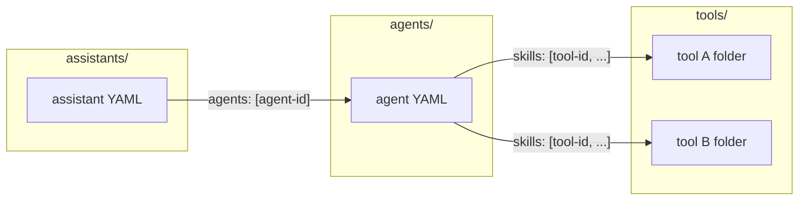

# Developing VGen Use Cases with the CLI

This document is a standalone reference for developing use cases on the vgen agent platform using the vgen CLI. It covers folder layout, YAML semantics, how agents connect to tools and assistants to agents, environment configuration, CLI operations (push and pull), and how to write system context, agent instructions, and JS tool handlers.

---

## Prerequisites

- **VGen CLI** – Built and available as `vgen` in your path (Rust project under repo root).
- **Configuration** – Set up via a `.env` file in the project root (or cwd) or via a config file. See [Environment and .env](#environment-and-env) below.

---

## Environment and .env

The CLI loads configuration from the environment. A `.env` file in the project root (or cwd) is loaded at startup. Config can also be read from a YAML file (path from `vgen_CONFIG` or default `~/.vgen/config.yaml`); **environment variables override** the config file.

### Allowed properties (environment variables)

| Variable | Purpose | Required / Default |
|----------|---------|--------------------|
| `vgen_BASE_URL` | API base URL for the vgen platform. | Optional; default: `https://api-dev.ai.resmed.com`. |
| `vgen_API_KEY` | API key (or JWT) for authenticating requests. | **Required** for push/pull and `config validate`. |
| `vgen_SECRET` | Secret used to sign JWTs for API calls (when using JWT auth). | Required when the client uses JWT. |
| `vgen_ROC_SESSION` | Optional ROC session value. | Optional. |
| `vgen_CONFIG` | Path to a YAML config file (overrides default `~/.vgen/config.yaml`). | Optional. |
| `vgen_IDS_FILE` | Path to the IDs store file (slug → id mapping). | Optional; default: `~/.vgen/ids.yaml`. |
| `vgen_TOOLS_DIR` | Directory containing tool folders. | Optional; default: `tools` under cwd. |
| `vgen_AGENTS_DIR` | Directory containing agent YAML files. | Optional; default: `agents` under cwd. |
| `vgen_ASSISTANTS_DIR` | Directory containing assistant YAML files. | Optional; default: `assistants` under cwd. |

### How to use .env to achieve the use case workflow

1. Create a `.env` file in the repo root (or cwd) with at least:
   - `vgen_API_KEY=<your-api-key>`
   - `vgen_SECRET=<your-secret>` (if your setup uses JWT auth)
2. Optionally set `vgen_BASE_URL` for a different environment (e.g. production).
3. Optionally set `vgen_TOOLS_DIR`, `vgen_AGENTS_DIR`, `vgen_ASSISTANTS_DIR` if your folders live elsewhere.
4. Run `vgen config show` to verify base_url and that api_key is set.
5. Run `vgen config validate` to check connectivity.
6. Use **push** to upload tools/agents/assistants and **pull** to sync from the platform.

**Note:** `.env` is in `.gitignore`; do not commit secrets.

---

## CLI operations (push and pull)

The primary workflow is **push** (local → platform) and **pull** (platform → local). Only these operations are documented here.

### Tools

| Command | Description |
|---------|-------------|
| `vgen tool push <name> [--tools-dir <PATH>]` | Loads `tools/<name>/` (or `<PATH>/<name>/`): `tool.yaml` + handler (and `package.json` for non-JS). If YAML has no `id`, creates the tool via API and writes the new `id` back to the YAML; if `id` is present, updates the tool. Output: `Pushed tool: <id>`. |
| `vgen tool pull <name> [--tools-dir <PATH>]` | Requires `id` in `tools/<name>/tool.yaml`. Fetches the tool from the API and overwrites local YAML, handler, and (if present) `package.json`. Output: `Pulled tool: <name>`. |

### Agents

| Command | Description |
|---------|-------------|
| `vgen agent push <name> [--agents-dir <PATH>]` | Loads `agents/<name>.yaml` (or `<PATH>/<name>.yaml`). No `id` → create and write `id` back; with `id` → update. Output: `Pushed agent: <id>`. |
| `vgen agent pull <name> [--agents-dir <PATH>]` | Requires `id` in the agent YAML. Fetches the agent and overwrites the local YAML. Output: `Pulled agent: <name>`. |

### Assistants

| Command | Description |
|---------|-------------|
| `vgen assistant push <name> [--assistants-dir <PATH>]` | Loads `assistants/<name>.yaml`. No `id` → create and write `id` back; with `id` → update. Output: `Pushed assistant: <id>`. |
| `vgen assistant pull <name> [--assistants-dir <PATH>]` | Requires `id` in the assistant YAML. Fetches the assistant and overwrites the local YAML. Output: `Pulled assistant: <name>`. |

### Config

| Command | Description |
|---------|-------------|
| `vgen config show` | Print current config (base_url, masked api_key, roc_session, config file path, env var names). |
| `vgen config validate` | Validate base URL and API key with a test request. |

Directory overrides (`--tools-dir`, `--agents-dir`, `--assistants-dir`) align with the env vars `vgen_TOOLS_DIR`, `vgen_AGENTS_DIR`, `vgen_ASSISTANTS_DIR` when not passed.

---

## Architecture and connections

### Folder layout

- **`tools/<name>/`** – One folder per tool. Contains:
  - **`tool.yaml`** (or `tool.yml`, `config.yaml`): metadata and spec; **`id`** is the stable tool ID.
  - **Handler:** `handler.js`, `index.js`, `handler.ts`, or `index.ts`. For **type: JS** no `package.json` is required; for other types (e.g. FAAS), `package.json` is required.
- **`agents/<name>.yaml`** – One file per agent. **`id`** = agent ID; **`skills`** = list of **tool IDs** (from `tools/*/tool.yaml`).
- **`assistants/<name>.yaml`** – One file per assistant. **`id`** = assistant ID; **`agents`** = list of **agent IDs** (from `agents/*.yaml`).

### Connection rules

- **Agent → Tools:** In `agents/<name>.yaml`, the **`skills`** array must list **tool IDs**. Each value must match the `id` in the corresponding `tools/<folder>/tool.yaml`.
- **Assistant → Agents:** In `assistants/<name>.yaml`, the **`agents`** array must list **agent IDs**. Each value must match the `id` in the corresponding `agents/<name>.yaml`.



### End-to-end flow (writing a use case)

1. Define **tools** (folder + `tool.yaml` + handler); record each tool’s `id`.
2. Define **agent** (`agents/<name>.yaml`) with `skills` = those tool IDs; write **system instructions** (role, when to use each tool, order, rules).
3. Define **assistant** (`assistants/<name>.yaml`) with `agents` = that agent’s ID; write **system context** (what the assistant is, which agent/tools, scope, errors).

---

## Folder and file reference

### Tools

- **Location:** `tools/<name>/` (or `vgen_TOOLS_DIR/<name>/`).
- **Required files:** A single YAML file (`tool.yaml`, `tool.yml`, `config.yaml`, or `config.yml`) and a handler file (`handler.js`, `index.js`, `handler.ts`, or `index.ts`). For type other than **JS**, `package.json` is also required.

**Key fields in tool YAML:**

| Field | Description |
|-------|-------------|
| `id` | Stable tool ID (written back after first push if missing). |
| `name` | Display name of the tool. |
| `description` | Short description. |
| `type` | e.g. `JS` or `FAAS`. **JS** = no `package.json`; FAAS = code + `package.json`. |
| `input_modes` | e.g. `text/plain`, `application/json`. |
| `output_modes` | e.g. `text/plain`, `application/json`. |
| `systemInstructions` | **List of strings** (array); when to use the tool, input/output contract, quality rules. The API expects an array, not a single multiline string. |
| `arguments` | **Object (map):** each key = argument name; value = `{ type, required, description }`. Do not use a list of `{ name, type, required, description }`. |
| `examples` | Optional list of example prompts. |
| `tags` | Optional list of tags. |

**Required fields for API (tools):** The create/update API may require `version` (e.g. `"1.0"`), `createdBy` (e.g. `""`), and `managedBy` (array, e.g. `[]`). Include these if push fails with missing field errors.

**Arguments format (key-value object):**

```yaml
arguments:
  supplierName:
    type: string
    required: true
    description: Supplier name or partial name to search for
  limit:
    type: number
    required: false
    description: Maximum number of results to return (optional)
```

### Agents

- **Location:** `agents/<name>.yaml` or `agents/<name>.yml` (or under `vgen_AGENTS_DIR`).

**Key fields in agent YAML:**

| Field | Description |
|-------|-------------|
| `id` | Stable agent ID (written back after first push if missing). |
| `name` | Display name. |
| `slug` | Slug identifier. |
| `description` | Short description. |
| `systemInstructions` | List of strings; role, tool order, when to use each tool, rules. |
| `skills` | **List of tool IDs** (must match `id` in `tools/*/tool.yaml`). |
| `is_public` | Boolean. |
| `roles` | List of role identifiers. |

**Required fields for API (agents):** Include `slug`, `version` (e.g. `"1.0"`), `createdBy` (e.g. `""`), `managedBy` (array, e.g. `[]`), and `admins` (array, e.g. `[]`) when the API requires them. **systemInstructions** must be a list of strings, not a multiline string.

Other fields (e.g. `guardrailsContext`) may appear; see `agents/code-forge.yaml` and `src/specs/agent.rs` for canonical key order.

### Assistants

- **Location:** `assistants/<name>.yaml` or `assistants/<name>.yml` (or under `vgen_ASSISTANTS_DIR`).

**Key fields in assistant YAML:**

| Field | Description |
|-------|-------------|
| `id` | Stable assistant ID (written back after first push if missing). |
| `name` | Display name. |
| `slug` | Slug identifier. |
| `description` | Short description. |
| `status` | e.g. `active`. |
| `visibility` | e.g. `private`. |
| `agents` | **List of agent IDs** (must match `id` in `agents/*.yaml`). |
| `systemContext` | String; what the assistant is, which agent/tools, scope, error handling. |
| `guardrailsContext` | Optional. String context passed to the **guardrail server** to verify whether the user's question or requested operation is allowed. Describe allowed operations and scope; the guardrail server uses this to accept or reject the request. |
| `guardrailsViolationFallback` | Optional. **Fallback message** shown to the user when the guardrail server rejects the request (guardrails violation). Use a short, user-friendly message that explains what the assistant can do instead. |

**Guardrails (assistant):** To restrict what users can ask or do, set **guardrailsContext** (context sent to the guardrail server for validation) and **guardrailsViolationFallback** (message shown when the request is rejected). The guardrail server evaluates the user question/operation against the context and allows or rejects it; on rejection, the user sees the fallback message. When the assistant uses HITL cards or forms, include in **guardrailsContext** that HITL submission messages (card confirm/cancel and form submissions with field data) are allowed so they are not rejected.

**Required fields for API (assistants):** Include `slug`, `version`, `createdBy`, `managedBy`, `admins`, `status` (e.g. `active`), and `visibility` (e.g. `private`) when the API requires them. Quote **description** if it contains a colon to avoid YAML parsing issues.

---

## Step-by-step use case checklist

1. **Create tool folder(s):** For each tool, create `tools/<name>/` with `tool.yaml` and `handler.js` (or other allowed handler name). Set `type: JS` if no `package.json`; otherwise include `package.json`. Leave `id` empty for a new tool (CLI will write it on first push).
2. **Create or update agent YAML:** Create or edit `agents/<name>.yaml`. Set **`skills`** to the list of **tool IDs** (from each `tools/<folder>/tool.yaml` `id`). Write **system instructions**: role, tool order, when to use each tool, rules.
3. **Create or update assistant YAML:** Create or edit `assistants/<name>.yaml`. Set **`agents`** to the list of **agent IDs** (from `agents/*.yaml`). Write **system context**: what the assistant is, which agent/tools, scope, error handling.
4. **Push:** Run `vgen tool push <name>` for each tool, then `vgen agent push <name>`, then `vgen assistant push <name>`.
5. **Pull (when needed):** To refresh local YAML/handlers from the platform after changes elsewhere, use `vgen tool pull <name>`, `vgen agent pull <name>`, `vgen assistant pull <name>`.

---

## System context vs system instructions

- **Assistant `systemContext`:** Identity (what this assistant is), which agent (and tools) it uses, scope (in-scope vs out-of-scope), and how to handle errors (e.g. do not expose internals). Keep it short and token-efficient; avoid long trigger/greeting/flow details that belong in the agent.
- **Agent `systemInstructions`:** Role, **order** of tools, **when** to call each tool, and rules (e.g. do not call code-gen before form submit). Be precise and step-oriented.
- **Tool `systemInstructions`:** Input/output contract, **when** this tool is used in the flow (e.g. “only after user has submitted the HITL form”), and quality/fallback rules. Align with the agent’s flow.

---

## JS tool handlers (and “fast” services)

- **Handler contract:** The handler is a **script**, not a function. Do **not** wrap code in `function handler(context) { ... }`. The platform injects `context` (e.g. `context?.input` with the tool arguments) and executes the script. Start directly with `try { ... } catch (e) { ... }`. Return a **JSON string** (e.g. `return JSON.stringify({ success, message, ... })`). On error, return a JSON object with `success: false` and an `error` message.
- **Optional `agentResponseContext`:** The handler can include an `agentResponseContext` string in the returned JSON; the platform can pass this to the agent to guide how to present the tool result (e.g. “Just return the code block to the user”).
- **Platform APIs:** Handlers may use platform-provided APIs such as `askLLMStructuredOutput` (for LLM calls with a schema) and `queryRecords` (for data queries). See `tools/code-forge-hitl/handler.js`, `tools/api-code-generator/handler.js`, and `tools/pr-supplier-search/handler.js` for patterns.
- **Type JS vs FAAS:** For **type: JS**, no `package.json` is required; the CLI only uploads the handler code. For **FAAS**, the CLI expects `package.json` and uploads both code and package.json.

Reference implementations:

- [tools/code-forge-hitl/handler.js](../tools/code-forge-hitl/handler.js) – Compose HITL config using LLM and queryRecords, return config + agentResponseContext.
- [tools/api-code-generator/handler.js](../tools/api-code-generator/handler.js) – Generate PL/SQL using askLLMStructuredOutput, return apiCode/fallback and agentResponseContext.
- [tools/pr-supplier-search/handler.js](../tools/pr-supplier-search/handler.js) – Script-style handler (try/catch, no function wrapper); fetches HITL config via queryRecords and returns HITL response shape.

### Tools that return HITL config

When a tool returns a HITL config so the platform can show an adaptive card to the user:

1. **Tool name:** The tool **name** in `tool.yaml` must end with **"HITLConfig"** (e.g. "PR Supplier Search HITLConfig") so the platform recognizes the response and displays the HITL.
2. **Fetch config:** In the handler, use `queryRecords([{ collectionName: "hitlConfig", query: { slug: "<hitl-slug>" } }])`. Use the slug that matches your `hitl/<name>/meta.yaml` (e.g. `pr-supplier-confirm`). The record has `config` (JSON string), `preMessage`, `postMessage`.
3. **Placeholders in config:** In the HITL card JSON (e.g. `hitl/<name>/config.json`), use placeholders such as `"value": "${supplierName}"` or `"value": "${supplierId}"` in FactSet, TextBlock, or other fields where dynamic data should appear.
4. **Substitute in handler:** The frontend renders the card from the **config** object only; it does not perform placeholder substitution. In the handler, **replace placeholders inside the config** (e.g. recursively over the parsed config object, replacing `${supplierName}`, `${supplierId}`, etc. with actual values) before returning. Return the **substituted** config so the card shows real data (e.g. supplier name and ID) to the user.
5. **Return shape:** Return `JSON.stringify({ success, message, config: JSON.stringify(config), preMessage: record?.preMessage, postMessage: record?.postMessage, values: { ... }, agentResponseContext? })`. Use the substituted `config`; include **values** (e.g. `supplierName`, `supplierId`) for reference and audit—the platform does not use `values` to fill the card; the card is filled by the config you return.
6. **Missing record:** If no HITL record is found, return a fallback response without `config`, `preMessage`, or `postMessage` so the agent still receives useful data (e.g. search results).

Example: [tools/pr-supplier-search/](../tools/pr-supplier-search/) (PR Supplier Search HITLConfig) — substitutes `${supplierName}` and `${supplierId}` in the config and returns `values` for audit.

---

## FAAS Tool Type and Runtime SDKs

For complete documentation on FAAS tools — including all Runtime SDK functions (Prajna, Smriti, Kriya), handler patterns, context object structure, error handling, npm module usage, and worked examples — see **[docs/FAAS-FUNCTIONS-GUIDE.md](docs/FAAS-FUNCTIONS-GUIDE.md)**.

### Overview

**FAAS** (Function as a Service) tools run in a Docker container with a full Node.js runtime. They differ from **type: JS** tools in several key ways:

- Support `package.json` npm dependencies
- Have access to pre-configured **Runtime SDKs** (`smriti`, `prajna`, `kriya`)
- Require both a handler file and `package.json` when pushed via CLI
- Support longer execution time and TypeScript

**When to use FAAS:**
- When you need npm packages or external dependencies
- When you need database, vector search, or secrets access via Runtime SDKs
- When the logic is too complex or long-running for a JS fast service

**When to use JS (fast services):**
- Simple scripts with no external dependencies
- Quick data transforms or API calls using platform APIs only (`askLLMStructuredOutput`, `queryRecords`)

### Handler pattern

Every FAAS function must export `async function handler(event)`. The `event.context` object contains execution context injected by the platform.

```javascript
import { smriti } from '/runtime/runtime-sdks/smriti.js';

async function handler(event) {
  const context = event.context;

  try {
    const { query } = context.input;

    const records = await smriti.db.queryRecords({
      documentqueries: [{ collection: "myCollection", query: { status: "active" } }]
    });

    return { success: true, data: records };

  } catch (error) {
    // Always catch — uncaught errors crash the container
    return { success: false, error: error.message };
  }
}

export default handler;
```

### Runtime SDKs (quick reference)

| Import | Service | Modules |
|--------|---------|---------|
| `import { smriti } from '/runtime/runtime-sdks/smriti.js'` | Smriti (data) | `smriti.db`, `smriti.vector`, `smriti.secrets` |
| `import { prajna } from '/runtime/runtime-sdks/prajna.js'` | Prajna (LLM) | `prajna.llm`, `prajna.embedding`, `prajna.chat` |
| `import { kriya } from '/runtime/runtime-sdks/kriya.js'` | Kriya (engine) | `kriya.agent`, `kriya.assistant`, `kriya.tool` |

See **[docs/FAAS-FUNCTIONS-GUIDE.md](docs/FAAS-FUNCTIONS-GUIDE.md)** for the full function reference for each module.

---

### FAAS vs JS Tools Comparison

| Feature | JS (Fast Service) | FAAS |
|---------|------------------|------|
| Execution | Script runner | Docker container |
| Dependencies | None (stdlib only) | Full npm with package.json |
| Runtime SDKs | ❌ Not available | ✅ Smriti, Prajna, Kriya |
| Cold Start | ~10-50ms | ~2-5 seconds |
| Execution Time | <1 second | Up to 60 seconds |
| TypeScript | ❌ No compilation | ✅ Full TS support |
| Use Case | Simple transforms, API calls | Complex logic, DB/vector ops |
| Platform APIs | ✅ askLLM, queryRecords | ✅ Same + Runtime SDKs |

---

### HITL submission on the platform

When the user clicks a card button (e.g. Confirm, Choose different) or submits a form, the **platform sends a message to the agent**; that message is what the user “said” from the system’s perspective.

- **Card confirmation:** The message may look like a short line (e.g. "This is my data, please process further") plus a structured payload (e.g. `action: confirm` or `action: cancel`). The agent should treat it as confirmation or cancel and continue the workflow (e.g. proceed to line item entry or let the user choose a different supplier).
- **Form submission:** The message may look similar but include **form data** (field IDs from the adaptive card and the user’s entered values). The agent should treat it as submitted form data and proceed (e.g. create the PR with those line items).
- **Guardrails:** The guardrail server evaluates this message. For assistants that use HITL, **guardrailsContext** must explicitly state that such **HITL submission messages** (confirm/cancel and form submit with field data) are allowed and part of the assistant’s workflow; otherwise the guardrail may reject them and block the flow.

---

## Code Forge as reference use case

The **Code Forge** use case is the canonical example for a two-step flow (HITL form → code generation):

- **Assistant:** [assistants/code-forge.yaml](../assistants/code-forge.yaml) – Code Forge Assistant; `agents` points to the Code Forge Agent ID; short systemContext (identity, agent/tools, scope, errors).
- **Agent:** [agents/code-forge.yaml](../agents/code-forge.yaml) – Code Forge Agent; `skills` lists two tool IDs (ComposeHITLConfig, APICodeGenarator); system instructions describe the two-step flow and when to use each tool.
- **Tools:** [tools/code-forge-hitl/](../tools/code-forge-hitl/) (Compose HITL form), [tools/api-code-generator/](../tools/api-code-generator/) (generate PL/SQL after form submit).

Use these files as the reference when creating or editing use cases.

---

## Purchase Requisition as reference use case

The **Purchase Requisition (PR)** use case is a second reference for tools that return HITL config and for script-style JS handlers:

- **Assistant:** [assistants/purchase-requisition.yaml](../assistants/purchase-requisition.yaml) – PR Assistant; `agents` points to the PR Agent ID; required fields (slug, version, status, visibility, etc.) and quoted description.
- **Agent:** [agents/purchase-requisition.yaml](../agents/purchase-requisition.yaml) – PR Agent; `skills` lists two tool IDs; systemInstructions as array of strings; slug, version, createdBy, managedBy, admins.
- **Tools:** [tools/pr-supplier-search/](../tools/pr-supplier-search/) (name ends with HITLConfig; fetches `pr-supplier-confirm` HITL via queryRecords; substitutes `${supplierName}`/`${supplierId}` in config and returns config, preMessage, postMessage, values for audit), [tools/pr-create-requisition/](../tools/pr-create-requisition/) (create PR with line items).
- **HITL:** [hitl/pr-supplier-confirm/](../hitl/pr-supplier-confirm/) (supplier confirmation card), [hitl/pr-line-items/](../hitl/pr-line-items/) (line item entry form).

Use the PR use case when building flows that combine search, HITL confirmation, and a follow-up action (e.g. create requisition).
 